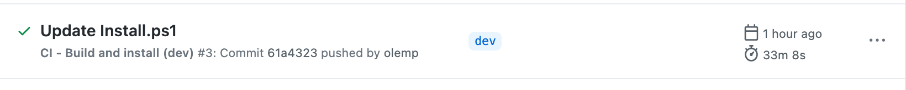

## Continuous Integration

Vi har satt opp continous integration (CI) ved hjelp av GitHub-handlinger.

### CI (releases/*)

Nøkkelord kan brukes i commit-meldingen for å unngå (eller tvinge) at CI kjører noen av jobbene.

- `[skip-ci]` for å unngå at jobben "Bygg utgivelsespakke" starter. Dette vil resultere i at ingen jobber starter, da jobbene "Oppgrader" og "Installer" er avhengige av jobben "Bygg utgivelsespakke".
- `[skip-upgrade]` for å unngå at jobben "Oppgrader" starter. Dette vil også hoppe over jobben "Installer" da den er avhengig av "Oppgrader".
- `[skip-install]` for å unngå at jobben "Installer" starter.
- `[upgrade-all-sites-to-latest]` for å kjøre skriptet `UpgradeAllSitesToLatest.ps1` i CI-modus.

### Bygg og installer (dev)

[ci-releases](../.github/workflows/ci-releases.yml) bygger en ny utgivelse ved _push_ til **releases/***.

Den kjører [Build-Release.ps1](../Install/Build-Release.ps1) med parameteren `-CI`, deretter kjører den [Install.ps1](../Install/Install.ps1) (også med `-CI` parameter, denne gangen med en kryptert streng som består av brukernavnet og passordet, lagret i en GitHub secret). URL-en å installere til er lagret i GitHub secret `CI_DEV_TARGET_URL`.

Med gjeldende tilnærming, uten hurtigbuffer (da den kjører `npm ci`), tar en full kjøring omtrent 25-35 minutter.

### CI (channels/test)

Nøkkelordet `[channels/test]` må brukes i commit-meldingen for at denne CI-en skal kjøre.

Den vil bygge en pakke for kanalen [test](../channels/test.json) og distribuere den til URL-en som er spesifisert i `SP_URL_TEST`.

### Bygg utgivelse (main)

[build-release](../.github/workflows/build-release.yml) bygger en ny utgivelsespakke ved **push** til **main**.
