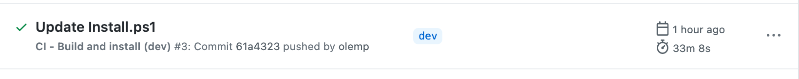

## Continuous integration

We have set up continuous integration using GitHub actions.

Keywords can be used in the commit message to avoid (or force) the CI running some of the jobs.

- `[skip-ci]` to avoid the _Build release package_ job starting. This will result in no jobs starting as the _Upgrade_ and _Install_ jobs are dependent on the job _Build release package_
- `[skip-upgrade]` to avoid the _Uprade_ job starting. This will also skip the _Install_ job as it's dependent on _Upgrade_
- `[skip-install]` to avoid the _Install_ job starting. 
- `[upgrade-all-sites-to-latest]` to run script `UpgradeAllSitesToLatest.ps1` in CI mode

### Build and install (dev)

[ci-releases](../.github/workflows/ci-releases.yml) builds a new release on _push_ to **releases/***.

It runs [Build-Release.ps1](../Install/Build-Release.ps1) with `-CI` param, then runs [Install.ps1](../Install/Install.ps1) (also with `-CI` param, this time with a encoded string consisting of the username and password, stored in a GitHub secret). The URL to install to is stored in the GitHub secret `CI_DEV_TARGET_URL`.

With the current approach, with no cache (as it runs `npm ci`), a full run takes about 25-35 minutes.

### Build release (main)

[build-release](../.github/workflows/build-release.yml) builds a new release package on **push** to **main**.
