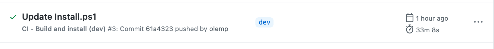

<!-- ⚠️ This README has been generated from the file(s) ".development-guide/.README" ⚠️--><p align="center">
  
</p> <p align="center">
  <b>Prosjektportalen et prosjektstyringsverktøy for Microsoft 365 basert på Prosjektveiviseren.</b></br>
  <sub>Utviklerguide<sub>
</p>

<br />


<details>
<summary>📖 Innholdsfortegnelse</summary>
<br />

[](#table-of-contents)

## ➤ Table of Contents

	* [➤ Site Design / Site Scripts](#-site-design--site-scripts)
	* [➤ JS Provisjoneringsmal](#-js-provisjoneringsmal)
	* [➤ Maler](#-maler)
		* [JSON-provisjonmal](#json-provisjonmal)
			* [Bygging av JSON-maler](#bygging-av-json-maler)
		* [PnP-maler](#pnp-maler)
			* [Portefølje](#porteflje)
			* [Innholdsmaler](#innholdsmaler)
	* [➤ NPM](#-npm)
	* [➤ Bygge en ny utgivelse](#-bygge-en-ny-utgivelse)
* [➤ For å kun bygge PnP-maler, bruk parameteren -SkipBuildSharePointFramework](#-for--kun-bygge-pnp-maler-bruk-parameteren--skipbuildsharepointframework)
	* [➤ Continuous Integration](#-continuous-integration)
		* [CI (releases/*)](#ci-releases)
		* [Bygg og installer (dev)](#bygg-og-installer-dev)
		* [CI (channels/test)](#ci-channelstest)
		* [Bygg utgivelse (main)](#bygg-utgivelse-main)
	* [➤ Opprettelse av en ny versjon](#-opprettelse-av-en-ny-versjon)
		* [Patch-utgivelse](#patch-utgivelse)
		* [Minor-utgivelse](#minor-utgivelse)
	* [➤ Versjonering](#-versjonering)
	* [➤ Installasjonskanaler](#-installasjonskanaler)
		* [Generere en ny kanalkonfigurasjon](#generere-en-ny-kanalkonfigurasjon)
		* [Bygge en ny versjon for en kanal](#bygge-en-ny-versjon-for-en-kanal)
	* [➤ README generering](#-readme-generering)
</details>


[](#site-design--site-scripts)

## ➤ Site Design / Site Scripts

Alt som er relatert til `site design` og tilhørende `site scripts` befinner seg i mappen **SiteScripts**.

Kildefilene finnes i mappen **src**.


[](#js-provisjoneringsmal)

## ➤ JS Provisjoneringsmal

Ikke alt vi ønsker å gjøre er tilgjengelig med `site design`, så vi bruker også [sp-js-provisioning](https://github.com/Puzzlepart/sp-js-provisioning). Vær oppmerksom på at vi bruker `Puzzlepart-branch` fra **pnp**.

Med våre PnP-innholdsmaler (se **3.2.2**) setter vi opp en standardmal. Standardmalene for våre støttede språk er bygget fra kildefilen [_JsonTemplate.json](../Templates/_JsonTemplate.json).

Vennligst merk **Parameters**-objektet.

```json
{
  "Parameters": {
    "ProvisionSiteFields": "Kolonner for Prosjektportalen (Prosjekt)",
    "ProjectContentTypeId": "0x0100805E9E4FEAAB4F0EABAB2600D30DB70C",
    "ProjectStatusContentTypeId": "0x010022252E35737A413FB56A1BA53862F6D5"
  }
}
```

| Parameter                  | Beskrivelse                                                                                 |
| -------------------------- | ------------------------------------------------------------------------------------------- |
| ProvisionSiteFields        | Feltene på nettstedet i denne gruppen vil bli kopiert til prosjektnettstedet under oppsett. |
| ProjectContentTypeId       | Innholdstype-ID for egenskapsinnholdstypen for prosjektet                                   |
| ProjectStatusContentTypeId | Innholdstype-ID for innholdstypen for prosjektstatus                                        |

I tillegg til parameterne som er spesifisert i [Standardmal.txt](../Templates/Portfolio/Prosjektmaler/Standardmal.txt), er det også følgende parametere:

| Parameter  | Beskrivelse                                                                               |
| ---------- | ----------------------------------------------------------------------------------------- |
| TermSetIds | Et kart over termsettfelt og termsett-ID. Brukes til å overstyre standard termsett-ID-er. |

Si at du vil bruke termsettet med ID-en **54da9f47-c64e-4a26-80f3-4d3c3fa1b7b2** for prosjektfase. Det interne feltnavnet for prosjektfasen er **GtProjectPhase**. Med standardmalen ville **Parameters**-objektet se slik ut:

```json
{
  "Parameters": {
    "ProvisionSiteFields": "Kolonner for Prosjektportalen (Prosjekt)",
    "ProjectContentTypeId": "0x0100805E9E4FEAAB4F0EABAB2600D30DB70C",
    "ProjectStatusContentTypeId": "0x010022252E35737A413FB56A1BA53862F6D5",
    "TermSetIds": {
      "GtProjectPhase": "54da9f47-c64e-4a26-80f3-4d3c3fa1b7b2"
    }
  }
}
```


[](#maler)

## ➤ Maler

### JSON-provisjonmal

På rotnivået i mappen **Maler** finner du følgende filer:

| Fil/Mappe                       | Beskrivelse                                                                                  |
| ------------------------------- | -------------------------------------------------------------------------------------------- |
| `Clean-Resx.ps1`                | Skript for å fjerne ubrukte **.resx**-ressurser                                              |
| `Find-FieldUsage.ps1`           | Skript for å finne bruk av felt                                                              |
| `Get-ComponentProperties.ps1`   | Skript for å hente komponentegenskaper fra `<pnp:ClientSidePage>`-instanser                  |
| `Encode-JSON.ps1`               | Skript for å ta innholdet av en JSON-fil, kode og minimere det, og lagre det i en `.txt`-fil |
| `Search-Resx.ps1`               | Skript for å søke etter ubrukte **.resx**-ressurser                                          |
| `tasks/generateResxJson.js`     | Node-skript for å generere en JSON-representasjon av **.resx**-filene                        |
| `tasks/generateJsonTemplate.js` | Node-skript for å generere JSON-maler for hver språk                                         |
| `_JsonTemplate.json`            | JSON-prosjektmal                                                                             |

#### Bygging av JSON-maler

Ved endringer i JSON-malen kan npm-oppgaven `watch` brukes. Den overvåker `_JsonTemplate.json` og bygger lokalversjon av dette til den tilsvarende innholdsmalen.

Ressurser fra **.resx**-filene i mappen "Portfolio" kan brukes i malen ved å bruke `{{tokens}}`.

**Eksempel:**

```json
{
    "ID": "0x0100A87AE71CBF2643A6BC9D0948BD2EE897",
    "Name": "{{ContentTypes_Uncertainty_Name}}",
    "Description": "",
    "Group": "{{ContentTypes_Group}}"
}
```

### PnP-maler

I tillegg har vi to PnP-provisjonsmaler.

| Mal                                 | Beskrivelse         |
| ----------------------------------- | ------------------- |
| [Portfolio](../Templates/Portfolio) | Porteføljeelementer |
| [Taxonomy](../Templates/Taxonomy)   | Taksonomi           |

#### Portefølje

| Fil/Mappe          | Beskrivelse                                                      |
| ------------------ | ---------------------------------------------------------------- |
| Objects            | PnP-elementer. Se https://github.com/pnp/PnP-Provisioning-Schema |
| SiteAssets         | Filer som skal lastes opp til SiteAssets                         |
| Portfolio.xml      | Hovedmal-fil                                                     |
| `Resources.*.resx` | Ressursfiler                                                     |

#### Innholdsmaler

Innholdsmaler finnes i mappen **Innhold**. Navnet på malen følger følgende mønster:

`Portfolio_content.{language_code}.xml`
`Portfolio_content_BA.{language_code}.xml`

`language_code` kan for eksempel være **no-NB** eller **en-US**.

Malene inneholder JSON-mal(er), oppgaver for planleggeren og elementer for sjekkliste for faser.


[](#npm)

## ➤ NPM

SharePoint Framework-løsninger publiseres uavhengig til `npm`.

- [PortfolioWebParts](https://www.npmjs.com/package/pp365-portfoliowebparts)
- [PortfolioExtensions](https://www.npmjs.com/package/pp365-portfolioextensions)
- [ProgramWebParts](https://www.npmjs.com/package/pp365-programwebparts)
- [ProjectWebParts](https://www.npmjs.com/package/pp365-projectwebparts)
- [ProjectExtensions](https://www.npmjs.com/package/pp365-projectextensions)
- [shared-library](https://www.npmjs.com/package/pp365-shared-library)


[](#bygge-en-ny-utgivelse)

## ➤ Bygge en ny utgivelse

For å lage en ny Prosjektportalen utgivelse, forsikre deg om at du er på `main` branch og synkronisert med **origin**.

Kjør PowerShell-skriptet `Build-Release.ps1` som ligger i `Install`-mappen:

```powershell
./Install/Build-Release.ps1


[](#for--kun-bygge-pnp-maler-bruk-parameteren--skipbuildsharepointframework)

# ➤ For å kun bygge PnP-maler, bruk parameteren -SkipBuildSharePointFramework
```

Installasjonspakken skal finnes i utgivelsesmappen.


[](#continuous-integration)

## ➤ Continuous Integration

Vi har satt opp continous integration (CI) ved hjelp av GitHub-handlinger.

### CI (releases/*)

[](https://github.com/Puzzlepart/prosjektportalen365/actions/workflows/ci-releases.yml)

Nøkkelord kan brukes i commit-meldingen for å unngå (eller tvinge) at CI kjører noen av jobbene.

- `[skip-ci]` for å unngå at jobben "Bygg utgivelsespakke" starter. Dette vil resultere i at ingen jobber starter, da jobbene "Oppgrader" og "Installer" er avhengige av jobben "Bygg utgivelsespakke".
- `[skip-upgrade]` for å unngå at jobben "Oppgrader" starter. Dette vil også hoppe over jobben "Installer" da den er avhengig av "Oppgrader".
- `[skip-install]` for å unngå at jobben "Installer" starter.
- `[upgrade-all-sites-to-latest]` for å kjøre skriptet `UpgradeAllSitesToLatest.ps1` i CI-modus.

### Bygg og installer (dev)

[ci-releases](../.github/workflows/ci-releases.yml) bygger en ny utgivelse ved _push_ til **releases/***.

Den kjører [Build-Release.ps1](../Install/Build-Release.ps1) med parameteren `-CI`, deretter kjører den [Install.ps1](../Install/Install.ps1) (også med `-CI` parameter, denne gangen med en kryptert streng som består av brukernavnet og passordet, lagret i en GitHub secret). URL-en å installere til er lagret i GitHub secret `CI_DEV_TARGET_URL`.

Med gjeldende tilnærming, uten hurtigbuffer (da den kjører `npm ci`), tar en full kjøring omtrent 25-35 minutter.



### CI (channels/test)

Nøkkelordet `[channels/test]` må brukes i commit-meldingen for at denne CI-en skal kjøre.

Den vil bygge en pakke for kanalen [test](../channels/test.json) og distribuere den til URL-en som er spesifisert i `SP_URL_TEST`.

### Bygg utgivelse (main)

[build-release](../.github/workflows/build-release.yml) bygger en ny utgivelsespakke ved **push** til **main**.


[](#opprettelse-av-en-ny-versjon)

## ➤ Opprettelse av en ny versjon

For å opprette en ny versjon har vi to alternativer: `Minor` og `Patch`. En ny minor-versjon bør opprettes når det er ny funksjonalitet av interesse for brukerne, mens patch-versjoner kan opprettes ofte med feilrettinger, justeringer og minimale funksjonelle forbedringer.

Økningen av versjonsnummeret gjøres ved hjelp av npm-skript. Dette gjøres på `releases/*` branch når funksjonaliteten som for øyeblikket er under utvikling, anses som klar for utgivelse.

### Patch-utgivelse

```powershell
npm version patch
git push --tags
```

### Minor-utgivelse

```powershell
npm version minor
git push --tags
```

Opprett deretter en PR for å merge `releases/*` inn i `main`. Resultatet fra GitHub Actions vil inkludere en utgivelsespakke som kan deles som en utgivelse på GitHub. Ingen manuell bygging er nødvendig.


[](#versjonering)

## ➤ Versjonering

Etter oppdatering av versjonen ved bruk av `npm version patch` eller `npm version minor`, kjøres oppgaven `tasks/automatic-versioning.js`. Dette synkroniserer versjonene på tvers av løsningen.

Denne oppgaven, `automatic-versioning.js`, kan også kjøres som en **npm-skript** utenfor hendelsen `postversion`.

```powershell
npm run sync-version
```

Etter at skriptet `sync-version` har blitt kjørt, er det viktig å publisere SharePointFramework-pakkene (@Shared, PortfolioWebParts, osv...) til npm.

Dette gjøres for hver pakke ved å kjøre følgende skript:

```powershell
npm install; npm run build; npm publish;
```

Hvis du må oppdatere og bruke en pakke under utvikling, legg til en midlertidig tag:

```powershell
npm install; npm run build; npm publish --tag temp;
```

Obs.: For å kunne publisere må du logge inn med en konto som har tilgang til pakkene på [npmjs](https://www.npmjs.com).


[](#installasjonskanaler)

## ➤ Installasjonskanaler

For å støtte installasjon av flere forekomster av _Prosjektportalen 365_ i en leietaker, støtter vi **installasjonskanaler**.

### Generere en ny kanalkonfigurasjon

For å generere en ny kanalkonfigurasjon, bruk `npm`-skriptet `generate-channel-config`.

For å generere en ny kanalkonfigurasjon for `test`:

```javascript
npm run-script generate-channel-config test
```

For å oppdatere en eksisterende kanalkonfigurasjon, legg til flagget `/update`:

```javascript
npm run-script generate-channel-config test /update
```

### Bygge en ny versjon for en kanal

For å bygge en ny versjon for en kanal, legg til flagget `-Channel` når du kjører utgivelsesskriptet.

**Eksempel (bygger for testkanal):**

```powershell
Install/Build-Release.ps1 -Channel test
```


[](#readme-generering)

## ➤ README generering

README er automatisk generert ved hjelp av [@appnest/readme](https://github.com/andreasbm/readme). Hoved README er generert fra [.README](../.README) mens denne er generert fra [.README](.README). Generering konfigureres med `blueprint.json` filene.

For hoved [.README](../.README) generering er de forskjellige delene inkludert fra [readme](../readme) mappen på rot nivå.

