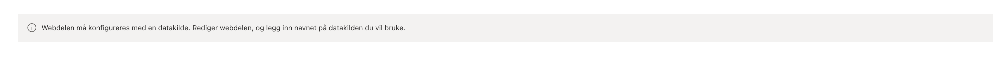
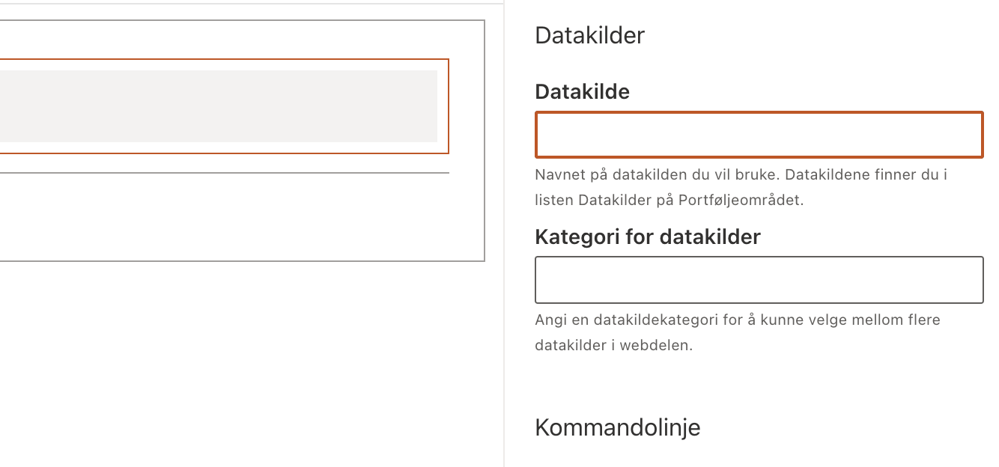
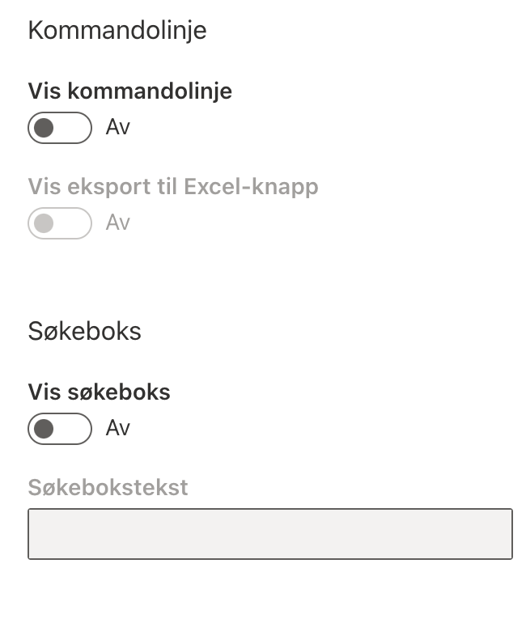
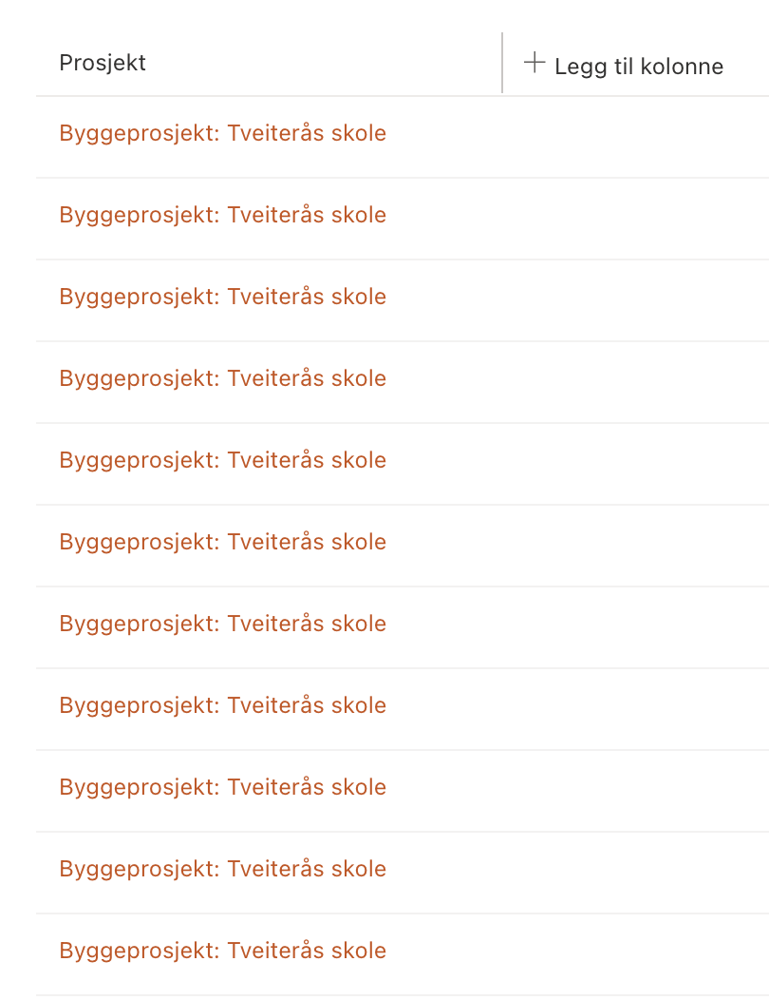
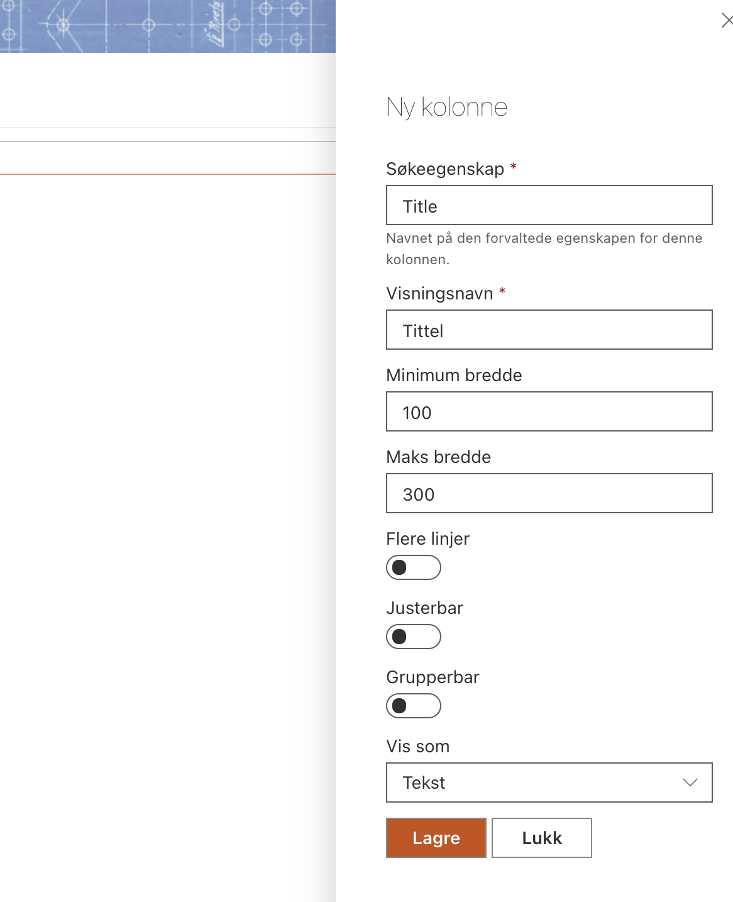
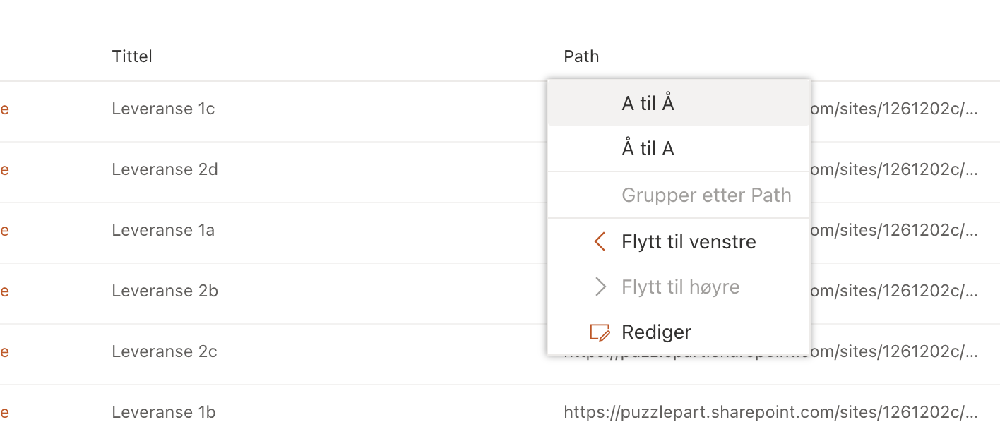
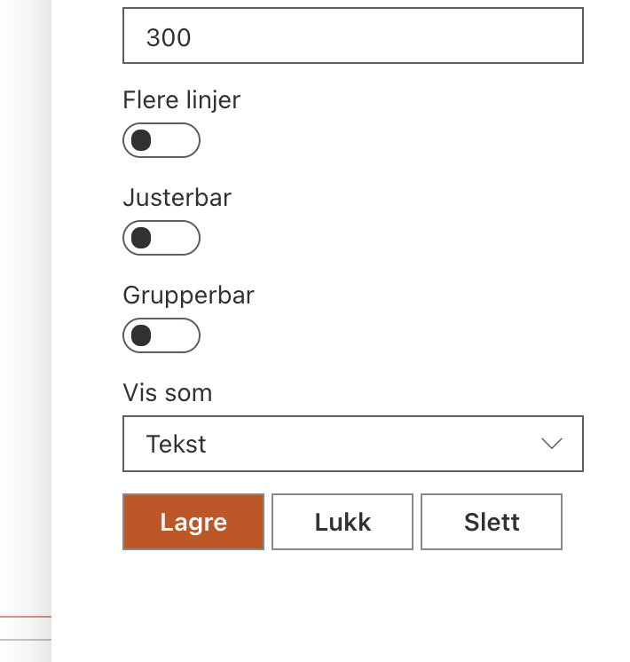

# PortfolioWebParts

_Publiseres til **npm** som `pp365-portfoliowebparts`_

## PortfolioAggregation

Webdel for dynamisk presentasjon av data fra forskjellige kilder spesifisert i datakildelisten (tilgjengelig gjennom konfigurasjonssiden).

Denne webdelen brukes på risikooversikten, leveranseoversikten og erfaringsloggsidene.

### Første gangs oppsett

Når du legger til webdelen første gang, må du spesifisere et datakildenavn:

Rediger webdelen og sett egenskapen **Datakilde**:

Du kan også justere noen andre innstillinger:

Når du har satt en datakilde (**Datakilde**), bør noen data være synlige (hvis tilgjengelig).

### Legge til tilpassede kolonner

Du vil bare ha prosjektnavnet / områdenavnet i begynnelsen, så du må legge til flere kolonner. Når du er i redigeringsmodus, vil en kolonneoverskrift med **Legg til kolonne** være synlig til høyre (_akkurat som i moderne SharePoint-lister_).

Klikk på kolonneoverskriften for å åpne kolonnepanelet:

### Justere kolonner

Når du er i redigeringsmodus, får du noen ekstra kommandoer i kolonnekontekstmenyen.

Du kan flytte kolonnene til venstre eller høyre, eller redigere kolonnen.

### Slette kolonner

Når du redigerer en kolonne, har du muligheten til å slette kolonnen.

## Serve

- Ta en kopi av `config/serve.sample.json` og gi den navnet `serve.json`
- Kjør `npm run serve`
