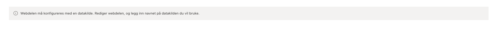
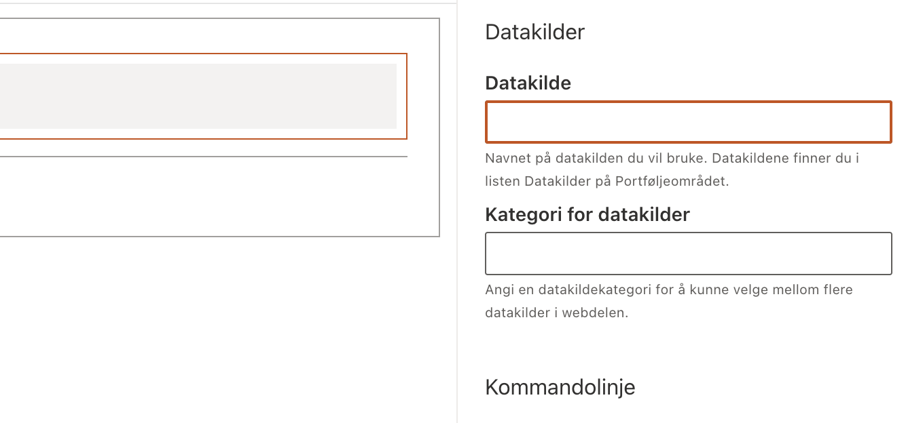
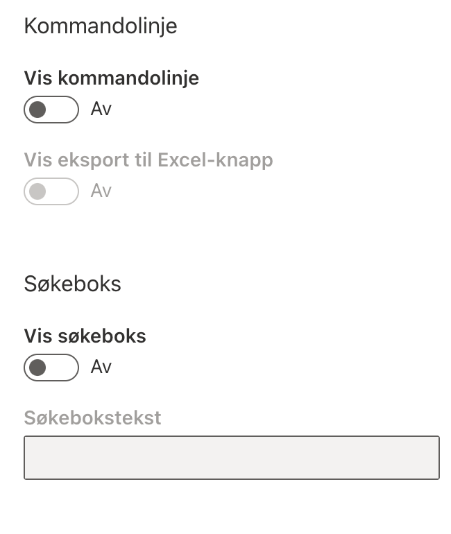
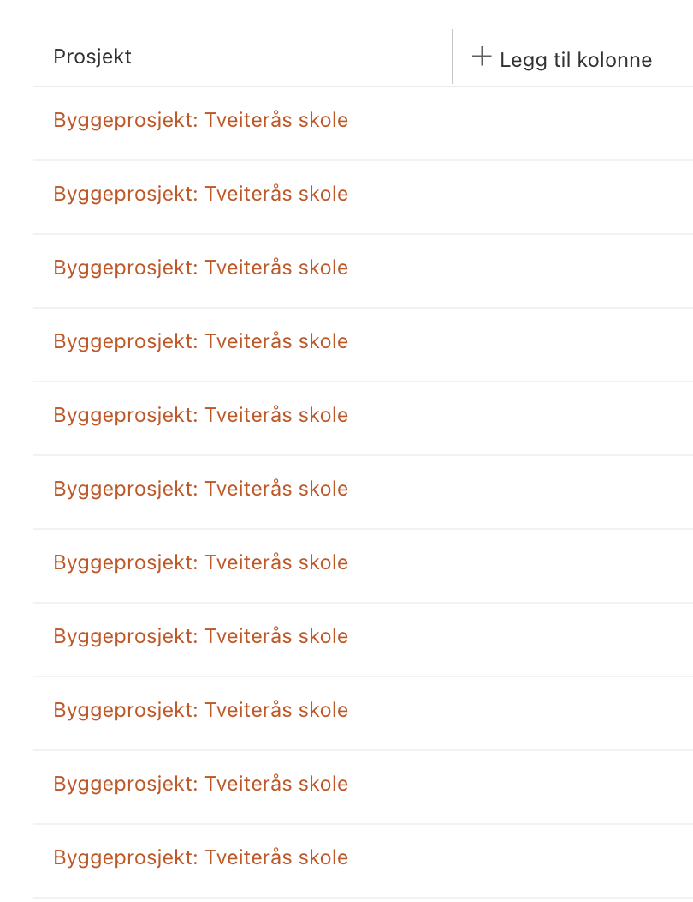
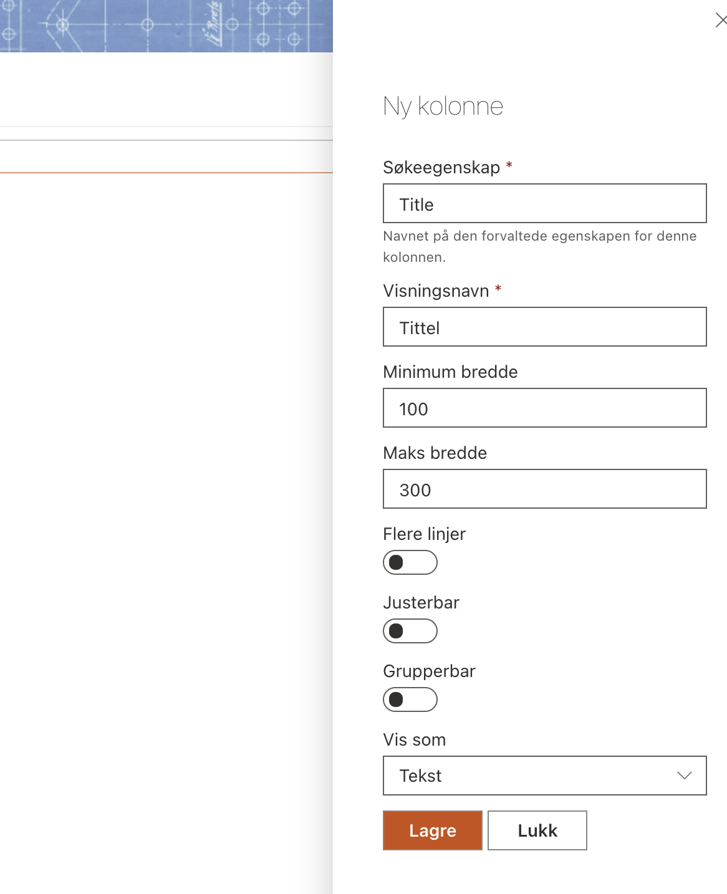
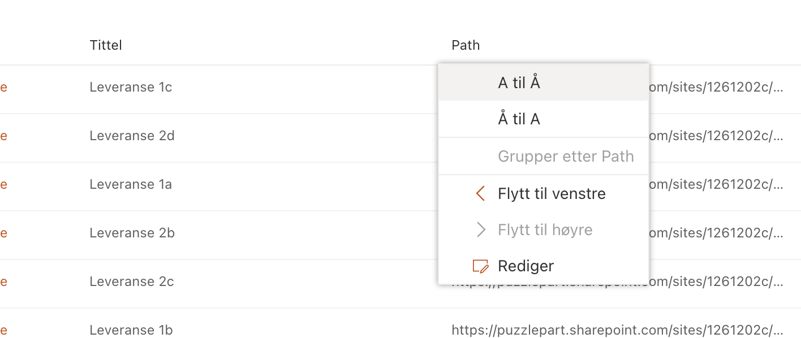
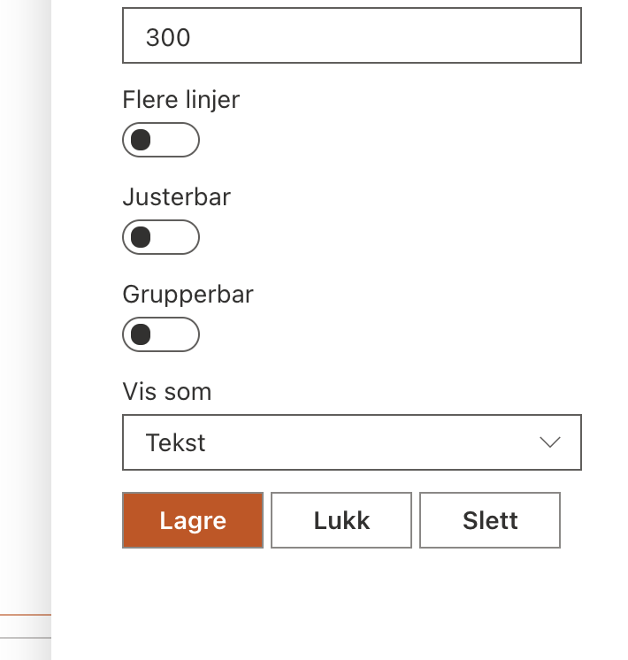

# PortfolioWebParts

_Publiseres til **npm** som `pp365-portfoliowebparts`_

## PortfolioAggregation

Webdel for dynamisk presentasjon av data fra forskjellige kilder spesifisert i datakildelisten (tilgjengelig gjennom konfigurasjonssiden).

Denne webdelen brukes på risikooversikten, leveranseoversikten og erfaringsloggsidene.

### Første gangs oppsett

Når du legger til webdelen første gang, må du spesifisere et datakildenavn:



Rediger webdelen og sett egenskapen **Datakilde**:



Du kan også justere noen andre innstillinger:



Når du har satt en datakilde (**Datakilde**), bør noen data være synlige (hvis tilgjengelig).

### Legge til tilpassede kolonner

Du vil bare ha prosjektnavnet / områdenavnet i begynnelsen, så du må legge til flere kolonner. Når du er i redigeringsmodus, vil en kolonneoverskrift med **Legg til kolonne** være synlig til høyre (_akkurat som i moderne SharePoint-lister_).



Klikk på kolonneoverskriften for å åpne kolonnepanelet:



### Justere kolonner

Når du er i redigeringsmodus, får du noen ekstra kommandoer i kolonnekontekstmenyen.



Du kan flytte kolonnene til venstre eller høyre, eller redigere kolonnen.

### Slette kolonner

Når du redigerer en kolonne, har du muligheten til å slette kolonnen.



## ProjectList (Prosjektutlisting)

### Vertikaler (faner)

Fanene i `Prosjektutlisting` konfigureres i egenskapspanelet under **Vertikalkonfigurasjon** → **Administrer vertikaler**. Hver vertikal har følgende felter:

| Felt                       | Beskrivelse                                                                         |
| -------------------------- | ----------------------------------------------------------------------------------- |
| **Tittel**                 | Teksten som vises på fanen                                                          |
| **Ikon**                   | Navn på ikon fra ikonkatalogen. Faller tilbake til `Cube` dersom navnet ikke finnes |
| **Klientfilter (JSON)**    | Filtrerer på beregnede egenskaper på prosjektmodellen                               |
| **Feltfilter (JSON)**      | Filtrerer på rå feltverdier fra `Prosjekter`-lista                                  |
| **Synlighetsregel (JSON)** | Skjuler hele fanen dersom regelen ikke er oppfylt                                   |
| **Krever tilgang**         | Viser kun prosjekter brukeren har tilgang til (porteføljeadministratorer ser alle)  |
| **Er standard**            | Fanen som er valgt når webdelen lastes                                              |
| **Søkeboksplassholder**    | Plassholdertekst i søkeboksen når fanen er aktiv                                    |

Alle filtrene kjøres på klienten, og alle betingelser må være oppfylt (`OG`).

#### Feltfilter

Feltfilter sammenligner mot rå feltverdier fra `Prosjekter`-lista, f.eks. `GtProjectPhaseText` eller `GtIsParentProject`. En vanlig verdi betyr likhet:

```json
{ "GtIsParentProject": true }
```

Sammenligningen er «løs», slik at SharePoints varianter av boolske verdier (`true`, `1`, `"1"`) alle treffer.

For å uttrykke noe annet enn likhet kan verdien i stedet være et operatorobjekt:

| Operator | Betydning | Eksempel                                                            |
| -------- | --------- | ------------------------------------------------------------------- |
| `$ne`    | Ikke lik  | `{ "GtProjectPhaseText": { "$ne": "Avslutte" } }`                   |
| `$in`    | Én av     | `{ "GtProjectPhaseText": { "$in": ["Planlegge", "Gjennomføre"] } }` |
| `$nin`   | Ingen av  | `{ "GtProjectPhaseText": { "$nin": ["Avslutte", "Realisere"] } }`   |

Merk:

- Et operatorobjekt med ukjent nøkkel treffer alt, slik at en skrivefeil utvider fanen i stedet for å tømme den
- Prosjekter uten tilhørende element i `Prosjekter`-lista går forbi feltfilteret og vises. Ved ekskludering (`$ne` / `$nin`) er en fane derfor ingen garanti for at ingenting slipper gjennom
- Tomme verdier (`null`, `""` eller felt som mangler) regnes som «ikke lik» og passerer `$ne`. Ønsker du kun prosjekter med en faktisk verdi, bruk `$in` med en eksplisitt liste

#### Klientfilter

Klientfilter sammenligner mot beregnede egenskaper på prosjektmodellen, f.eks.:

```json
{ "hasUserAccess": true }
```

Tilgjengelige egenskaper inkluderer `hasUserAccess`, `isUserMember`, `isParent` og `isProgram`. Klientfilter støtter kun likhet (streng sammenligning), ikke operatorene over.

#### Synlighetsregel

Synlighetsregel sammenligner mot webdelens tilstand og skjuler hele fanen dersom regelen ikke er oppfylt, f.eks.:

```json
{ "isUserInPortfolioManagerGroup": true }
```

#### Datagrunnlaget

Alle vertikaler filtrerer det samme datasettet, som hentes én gang når webdelen lastes. Datagrunnlaget er alle elementer i `Prosjekter`-lista i huben, koblet mot områdene i huben. En vertikal kan derfor ikke utvide utvalget, kun snevre det inn.

Prosjekter med livssyklusstatus `Avsluttet` fjernes som standard før vertikalene kjøres, og kan da ikke vises av noen vertikal. Slå på **Vis avsluttede prosjekter** i egenskapspanelet for å ta dem med i datagrunnlaget — da er det vertikalenes egne filtre som avgjør hvor de vises.

Feltet `GtProjectLifecycleStatus` har tre valg, og verdien er språkavhengig fordi den kommer fra områdekolonnen:

| Valg      | nb-NO       | en-US      |
| --------- | ----------- | ---------- |
| Aktivt    | `Aktivt`    | `Active`   |
| Avventer  | `Avventer`  | `Awaiting` |
| Avsluttet | `Avsluttet` | `Closed`   |

Merk at feltfilteret bruker listefeltet `GtProjectLifecycleStatus`, ikke den søkbare egenskapen `GtProjectLifecycleStatusOWSCHCS` som brukes i porteføljevisningene.

#### Ekskludere avsluttede prosjekter fra en vertikal

Nøklene i et feltfilter kombineres med `OG`, så en vertikal som allerede har et feltfilter utvides ved å legge til livssyklusstatus i samme objekt:

```json
{ "GtIsProgram": true, "GtProjectLifecycleStatus": { "$ne": "Avsluttet" } }
```

En vertikal uten feltfilter fra før (f.eks. `Mine prosjekter`, som kun bruker klientfilter) får feltfilteret satt fra scratch:

```json
{ "GtProjectLifecycleStatus": { "$ne": "Avsluttet" } }
```

For en fane som kun skal vise avsluttede prosjekter:

```json
{ "GtProjectLifecycleStatus": "Avsluttet" }
```

Bruker du samme oppsett på tvers av hubber med ulikt språk, list opp begge verdiene:

```json
{ "GtProjectLifecycleStatus": { "$nin": ["Avsluttet", "Closed"] } }
```

Når innstillingen slås på, får alle vertikaler uten filter på livssyklusstatus også med avsluttede prosjekter. Legg derfor til filteret over på de fanene som fortsatt skal holdes fri for dem.

## ProjectProvision (Bestillingsportalen)

Bestillings-webdelen (`ProjectProvisionWebPart`) er flyttet ut av denne pakken og vedlikeholdes nå i [Bestillingsportalen-repoet](https://github.com/Puzzlepart/bestillingsportalen) (fra Bestillingsportalen 2.1.0, pakken `bp-provision-web-parts`). Komponent-id-en er beholdt, så eksisterende sider virker etter at den nye pakken er distribuert — se oppgraderingsrekkefølgen i Bestillingsportalens `Upgrade.md`.

## Serve

- Ta en kopi av `config/serve.sample.json` og gi den navnet `serve.json`
- Kjør `npm run serve`
