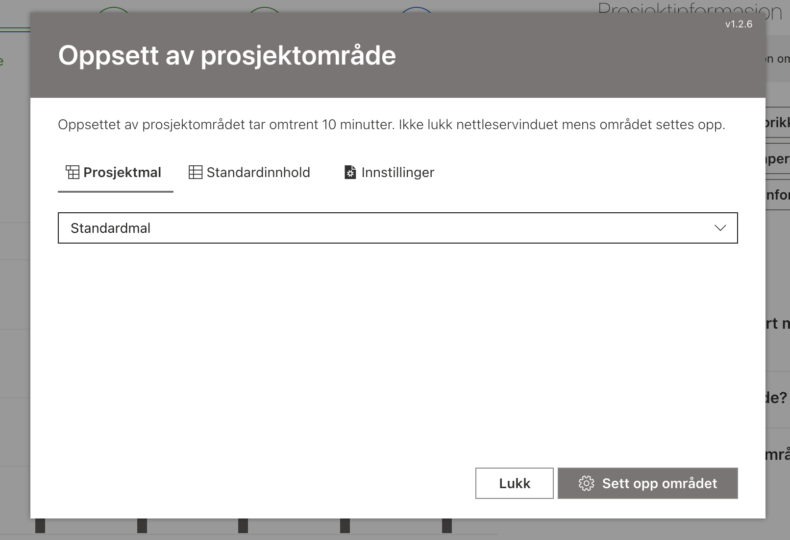

# ProjectExtensions

Denne løsningen inneholder SPFx-utvidelser for prosjektnivået.

_Publiseres til **npm** som `pp365-projectextensions`_

## Oppsett av prosjekt

Utvidelse for konfigurering av et nytt prosjekt.

Legges til alle prosjekter, og fjernes når konfigureringen/oppsettet er ferdig.

Brukeren velger en mal, valgfrie utvidelser og innstillinger.

### Prosjektmal

### Listeinnhold

### Innstillinger

## TemplateSelector

Utvidelse for kopiering av maler fra hub/portal-området til prosjektområdet.

Malene skal lagres i et bibliotek kalt `Malbibliotek`. Dette biblioteket opprettes når Prosjektportalen 365 installeres.

### Velge maler

I det første skjermbildet velger brukeren ønskede maler. De kan navigere i mappestrukturen som i et SharePoint-bibliotek.

### Velge målbibliotek og mappe

I det neste skjermbildet bestemmer brukeren hvor malene skal kopieres. De kan navigere i mappestrukturen akkurat som når de velger malene.

Hvis det er mer enn 1 bibliotek på prosjektområdet, kan brukeren også velge et annet bibliotek.

### Juster filnavn og tittel

Deretter kan de justere filnavnene og titlene.

### Følg fremdriften

Når brukeren har valgt sine maler, valgt målmappen og klikket start - vises fremdrift.

## Serve

- Ta en kopi av `config/serve.sample.json` og gi den navnet `serve.json`
- Kjør `npm run serve`

## Versjonering

Aldri oppdater versjonen av denne løsningen uavhengig. Versjonen holdes automatisk synkronisert med de andre pakkene.
