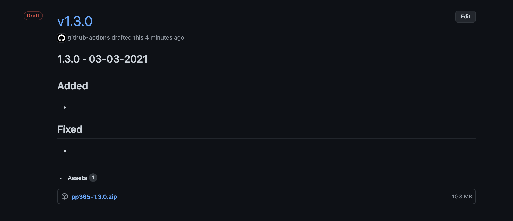

<!-- ⚠️ This README has been generated from the file(s) "dev/README.blueprint" ⚠️--><p align="center">
  
</p> <p align="center">
  <b>Prosjektportalen et prosjektstyringsverktøy for Microsoft 365 basert på Prosjektveiviseren.</b></br>
  <sub>Development guide<sub>
</p>

<br />


<details>
<summary>📖 Table of Contents</summary>
<br />

[](#table-of-contents)

## ➤ Table of Contents

* [➤ Site Design / Site Scripts](#-site-design--site-scripts)
* [➤ JS Provisioning Template](#-js-provisioning-template)
* [➤ Templates](#-templates)
	* [JSON provisioning template](#json-provisioning-template)
		* [Building JSON templates](#building-json-templates)
	* [PnP templates](#pnp-templates)
		* [Portfolio](#portfolio)
		* [Content templates](#content-templates)
* [➤ NPM](#-npm)
* [➤ Building a new release](#-building-a-new-release)
* [➤ Continuous integration](#-continuous-integration)
	* [Build and install (dev)](#build-and-install-dev)
	* [Build release (main)](#build-release-main)
</details>


[](#site-design--site-scripts)

## ➤ Site Design / Site Scripts

Everything related to the site design and the corresponding site scripts reside in the folder **SiteScripts**. 

The source files are found in the **src** folder.


[](#js-provisioning-template)

## ➤ JS Provisioning Template

Not everything we want to do is available with site designs, so we're also using [sp-js-provisioning](https://github.com/Puzzlepart/sp-js-provisioning). Please note that we´re using the Puzzlepart fork from **pnp**.

With our PnP content templates (see **3.2.2**) we're provisioning a default template. The default templates for our supported languages are built from the source file [_JsonTemplate.json](../Templates/_JsonTemplate.json).

Please note the **Parameters** object.

```json
{
  "Parameters": {
    "ProvisionSiteFields": "Kolonner for Prosjektportalen (Prosjekt)",
    "ProjectContentTypeId": "0x0100805E9E4FEAAB4F0EABAB2600D30DB70C",
    "ProjectStatusContentTypeId": "0x010022252E35737A413FB56A1BA53862F6D5"
  }
}
```

| Parameter                  | Description                                                  |
| -------------------------- | ------------------------------------------------------------ |
| ProvisionSiteFields        | The site fields in this group will be copied to the project site during provisioning. |
| ProjectContentTypeId       | Content type ID for the Project properties content type      |
| ProjectStatusContentTypeId | Content type ID for the Project status content type          |


In addition to the parameters specified in [Standardmal.txt](../Templates/Portfolio/Prosjektmaler/Standardmal.txt), there's also the following parameters:

| Parameter  | Description                                                  |
| ---------- | ------------------------------------------------------------ |
| TermSetIds | An map of term set fields and term set id. Used to override the default term set ids. |

Say you'd like to use the term set with ID **54da9f47-c64e-4a26-80f3-4d3c3fa1b7b2** for project phase. The internal field name for project phase is **GtProjectPhase**. With the default template, the **Parameters** object would look like this:


```json
{
  "Parameters": {
    "ProvisionSiteFields": "Kolonner for Prosjektportalen (Prosjekt)",
    "ProjectContentTypeId": "0x0100805E9E4FEAAB4F0EABAB2600D30DB70C",
    "ProjectStatusContentTypeId": "0x010022252E35737A413FB56A1BA53862F6D5",
    "TermSetIds": {
      "GtProjectPhase": "54da9f47-c64e-4a26-80f3-4d3c3fa1b7b2"
    }
  }
}
```


[](#templates)

## ➤ Templates

### JSON provisioning template

At the root level of the **Templates** folder, the following files are found:

| File/Folder                     | Description                                                  |
| ------------------------------- | ------------------------------------------------------------ |
| `Clean-Resx.ps1`                | Script to remove unused **.resx** resources                  |
| `Find-FieldUsage.ps1`           | Script to find field usage                                   |
| `Get-ComponentProperties.ps1`   | Script to get component properties from `<pnp:ClientSidePage>` instances |
| `Encode-JSON.ps1`               | Script to take the content of a JSON file, encode and minfiy at, and store it in a `.txt`file |
| `Search-Resx.ps1`               | Script to search for unused **.resx** resources              |
| `tasks/generateResxJson.js`     | Node script to generate a JSON representation of the **.resx** files |
| `tasks/generateJsonTemplate.js` | Node script to generate JSON templates for each language     |
| `_JsonTemplate.json`            | JSON project template                                        |

#### Building JSON templates

When doing changes to the JSON template the npm task `watch` can be used. This watches `_JsonTemplate.json` and builds localized version of this to the corresponding Content template.

Resources from the **.resx** files in the folder Portfolio can be used in the template using `{{tokens}}`.

**Example:**

```json
{
    "ID": "0x0100A87AE71CBF2643A6BC9D0948BD2EE897",
    "Name": "{{ContentTypes_Uncertainty_Name}}",
    "Description": "",
    "Group": "{{ContentTypes_Group}}"
}
```


### PnP templates

In addition we have two PnP provisioning templates. 

| Template                            | Description      |
| ----------------------------------- | ---------------- |
| [Portfolio](../Templates/Portfolio) | Portfolio assets |
| [Taxonomy](../Templates/Taxonomy)   | Taxonomy         |

#### Portfolio

| File/Folder        | Description                                                  |
| ------------------ | ------------------------------------------------------------ |
| Objects            | PnP assets. See https://github.com/pnp/PnP-Provisioning-Schema |
| SiteAssets         | Files to be uploaded to SiteAssets                           |
| Portfolio.xml      | Main template file                                           |
| `Resources.*.resx` | Resource files                                               |

#### Content templates

Content templates are found in the **Content** folder. The name of the template follows the following pattern:

`Portfolio_content.{language_code}.xml`

`language_code` can be for example **no-NB** or **en-US**.

The templates contains the JSON template(s), planner tasks and phase checklist items.


[](#npm)

## ➤ NPM

The SharePoint Framework solutions are published to `npm` independently.

- [@Shared](https://www.npmjs.com/package/pp365-shared)
- [ProjectWebParts](https://www.npmjs.com/package/pp365-projectwebparts)
- [ProjectExtensions](https://www.npmjs.com/package/pp365-projectextensions)
- [PortfolioWebParts](https://www.npmjs.com/package/pp365-portfoliowebparts)


[](#building-a-new-release)

## ➤ Building a new release

To build a new release make sure your on the `main`branch and in sync with **origin**.

Run the npm script `build:release`:

```shelll
npm run build:release
```

The installation package should be found in the release folder.


[](#continuous-integration)

## ➤ Continuous integration

/badge.svg?branch=dev)

We have set up continuous using GitHub actions.

### Build and install (dev)

[ci-build-install-dev](../.github/workflows/ci-dev.yml) builds a new release on _push_ to **dev**.

It runs [Build-Release.ps1](../Install/Build-Release.ps1) with `-CI` param, then runs [Install.ps1](../Install/Install.ps1) (also with `-CI` param, this time with a encoded string consisting of the username and password, stored in a GitHub secret). The URL to install to is stored in the GitHub secret `CI_DEV_TARGET_URL`.

With the current approach, with no cache, a full run takes about 30 minutes.


### Build release (main)

[build-release](../.github/workflows/build-release.yml) builds a new release package on _tag_ to **main**, then drafts a new GitHub release with the installation package.

