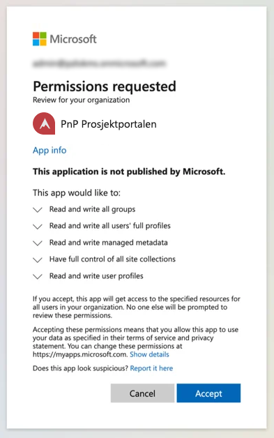

# Prosjektportalen 365 - 1.10.0 (September 2024)

**Versjon 1.10.0** adresserer følgende [issues](https://github.com/Puzzlepart/prosjektportalen365/issues?q=is%3Aissue+is%3Aclosed+milestone%3A1.10.0).
> **Nedlasting**: [v1.10.0](https://github.com/Puzzlepart/prosjektportalen365/releases)

---

Velkommen til versjon 1.10.0 av Prosjektportalen 365. Denne versjonen inneholder store endringer rundt autentisering ved installasjon/oppgradering av Prosjektportalen 365 som følge av endring fra Microsoft, i tillegg til dette er det ny funksjonalitet og en rekke forbedringer og feilrettinger. Her er noen av høydepunktene:

- **[Overgang til nyeste PnP PowerShell](#overgang-til-nyeste-pnp-powershell)** - Endringer i autentisering mot Microsoft 365 for å forbedre sikkerheten og funksjonaliteten
- **[Summeringsfelt i prosjektstatus](#summeringsfelt-i-prosjektstatus)** - Nytt felt som kan summere eller finne gjennomsnitt av verdier i prosjektstatusseksjoner
- **[Ytterligere tilpasning av idémodul](#ytterligere-tilpasning-av-idémodul)** - Mulighet til å endre godkjenningsvalg og beskrivelser for idémodulen

## Overgang til nyeste PnP PowerShell

> **Viktig**: Som en del av denne versjonen kreves det godkjenning av en ny app-registrering ved installasjon eller oppgradering av Prosjektportalen 365. Dette skyldes at den tidligere PnP Management Shell-appen ikke lenger er tilgjengelig. Appen må godkjennes av en Global Administrator eller Application Administrator. Godkjenningsprosessen vil automatisk starte ved installasjon. Merk at oppdateringer og installasjoner nå må gjøres med PowerShell 7 eller nyere.



Denne løsningen er en app-registrering, og ikke en selvstendig applikasjon som kjører autonomt med egne rettigheter. App-registreringen gir skriptene mulighet til å kjøre på vegne av en bruker, ved bruk av delegerte rettigheter. Dette betyr at appen arver rettighetene fra brukeren som initierer skriptet, og kun får tilgang til ressursene brukeren selv har tillatelser til som er innenfor brukerens eksisterende tilgangsnivåer. Det er verdt å merke seg at appen ikke gir oss i Puzzlepart noe innsyn eller tilgang til deres miljø.

Les mer om endringene som tredde i kraft 9. september 2024:

- [Register an Entra ID Application to use with PnP PowerShell](https://pnp.github.io/powershell/articles/registerapplication.html)
- [PnP PowerShell og Endringer i autentiseringsmetode PnP PowerShell](https://crayonconsulting.no/artikler/endringer-i-autentiseringsmetode-pnp-powershell).

## Summeringsfelt i prosjektstatus

Det er nå lagt til en ny funksjon som gjør det mulig å vise et summeringsfelt i prosjektstatusseksjoner. Denne funksjonen kan for eksempel brukes til å vise en totalverdi, et gjennomsnitt, eller en prosentberegning basert på informasjon fra ulike felter i seksjonen. Du kan selv velge hvilken type data som skal vises, som tall, valuta, eller prosent. I `Statusseksjoner` er det lagt til et nytt felt, `Summeringsfelt`.

Når du setter opp summeringsfeltet, må du definere følgende:

- **InternalName**: Det interne navnet på feltet du vil summere.
- **Summeringstype**: Du kan velge mellom addisjon (Add) eller gjennomsnitt (Avg).
- **Beskrivelse**: Teksten som skal stå over summeringen, som for eksempel "Gjennomsnitt av verdi" eller "Total sum".
- **Vis som**: Hvordan verdien skal vises, her kan du velge mellom valuta (currency), eller prosent (percentage). Dersom du ikke angir noe her vil det vises som tall.

Formatet for å sette opp verdien i summeringsfeltet er:

`InternalName;Summeringstype;Beskrivelse;Vis som`

Eksempler:

- Du kan vise gjennomsnitt av verdier.
  - `GtSum;Avg;Gjennomsnitt av summering`
- Du kan også vise en samlet sum, for eksempel total forventet verdi i kroner. (se bilde under)
  - `GtAddition;Add;Sum av forventet verdi;currency`

Denne funksjonen er tilgjengelig for følgende seksjoner:

- Listeseksjon
- Usikkerhetsseksjon


## Ytterligere tilpasning av idémodul

Det er lagt til mulighet for å endre godkjenningsvalg og beskrivelser for idémodulen. Dette kan konfigureres med JSON i `Idékonfigurasjon` listen. Det er også mulighet for å legge til flere valg enn de som følger med ut av boksen for å tilpasse godkjenningsprosessen til deres behov.


```json
{
    "approve": { "choice": "Godkjenn", "recommendation": "Godkjent for detaljering av idé" },
    "consideration": { "choice": "Under vurdering", "recommendation": "Under vurdering" },
    "reject": { "choice": "Avvis", "recommendation": "Avvist" }
}
```


Eksempel: Legge til flere valg for godkjenning

```json
{
    "approve": { "choice": "Godkjenn", "recommendation": "Godkjent for detaljering av idé" },
    "consideration": { "choice": "Under vurdering", "recommendation": "Under vurdering" },
    "reject": { "choice": "Avvis", "recommendation": "Avvist" },
    "fastApprove": { "choice": "Hurtiggodkjenning", "recommendation": "Godkjent for direkte bestilling" }
}
```

## Endringslogg

> For fullstendig endringslogg av alt som er med i denne utgivelsen, så kan du [trykke her for å lese mer](../CHANGELOG.md).

## Takk til dere

Sist, men ikke minst sier vi takk til alle som har bidratt til å melde inn feil, gitt oss verdifulle tilbakemeldinger og foreslått endringer.

Uten deres engasjement ville vi ikke vært i stand til å utvikle Prosjektportalen til det verktøyet det er i dag.

-Prosjektportalen-teamet
