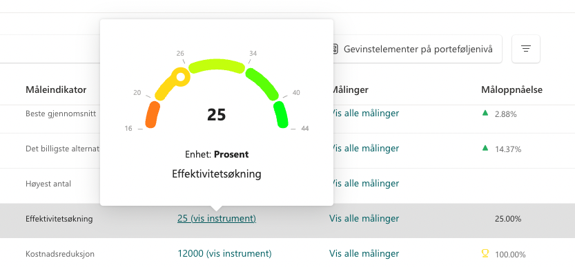
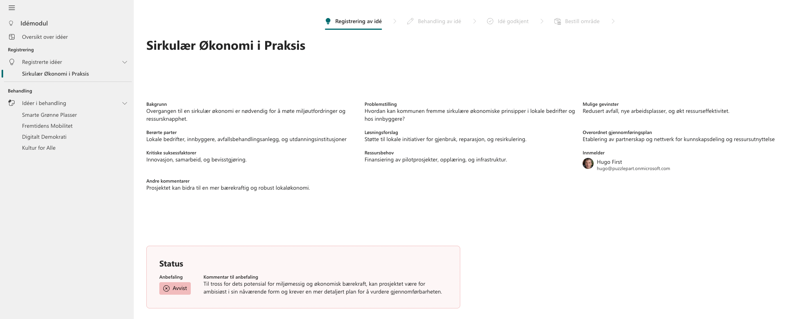
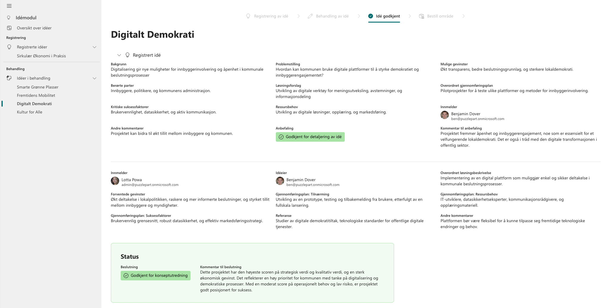
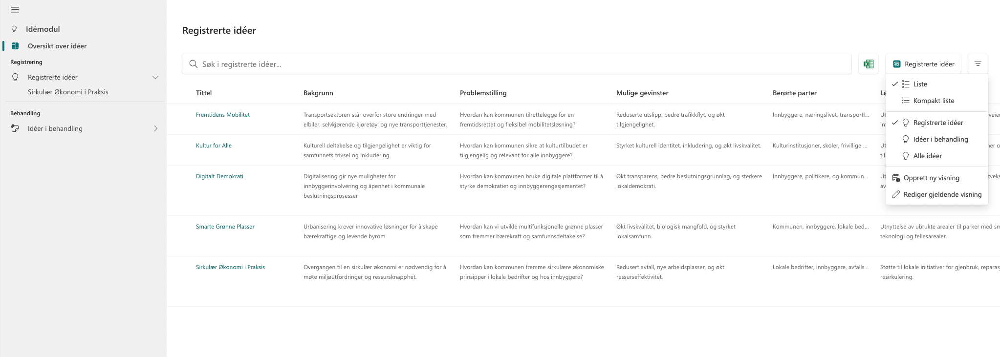
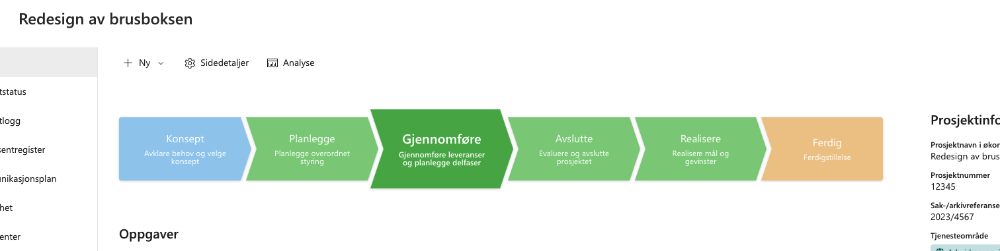
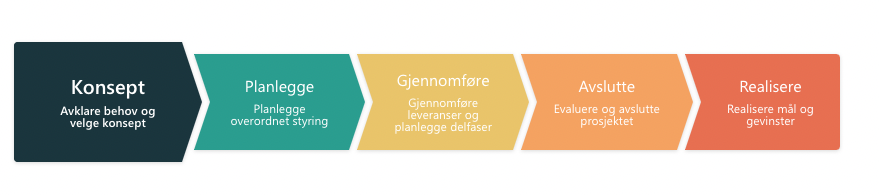
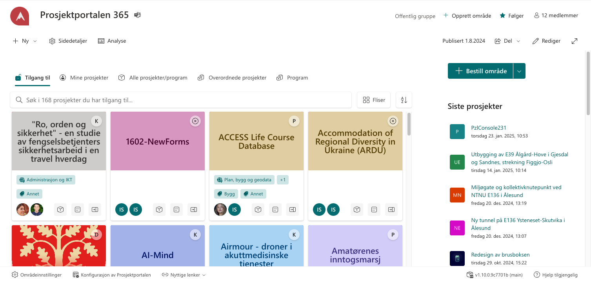
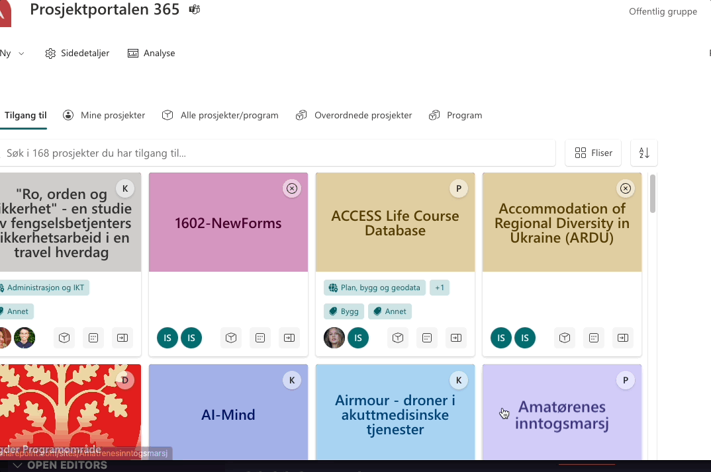
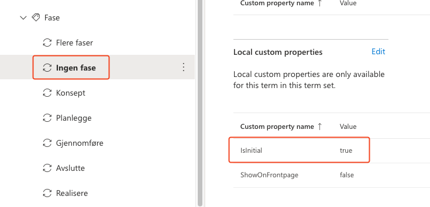
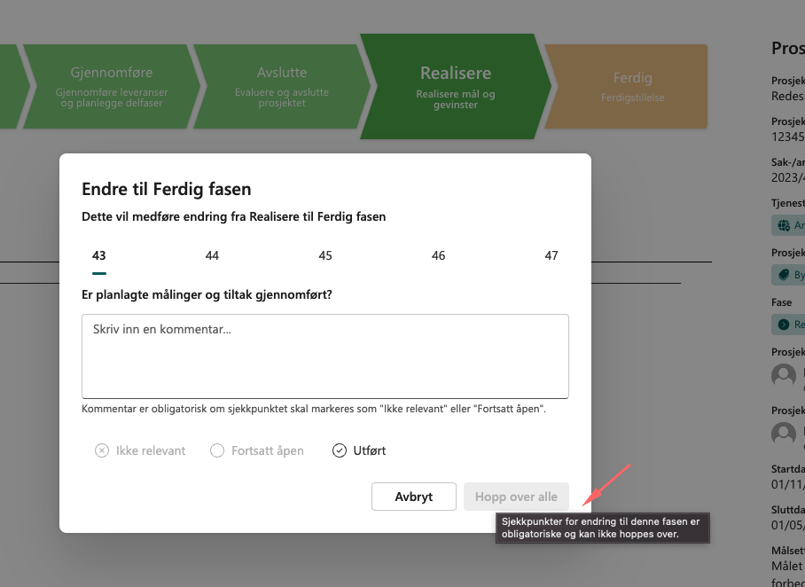

# Prosjektportalen 365 - 1.11.0 (Mars 2025)

**Versjon 1.11.0** adresserer følgende [issues](https://github.com/Puzzlepart/prosjektportalen365/issues?q=is%3Aissue+is%3Aclosed+milestone%3A1.11.0).
> **Nedlasting**: [v1.11.0](https://github.com/Puzzlepart/prosjektportalen365/releases)

---

Velkommen til versjon 1.11.0 av Prosjektportalen 365. I denne versjonen er det flere grunnleggende forbedringer og ny funksjonalitet som gjør det verdt å oppgradere til. Her er noen av høydepunktene:

- **[Instrumentvisning for 'Siste måling' på Gevinstoversikt](#instrumentvisning-for-siste-måling-på-gevinstoversikt)** - Ny visning for rask oversikt over siste måling.
- **[Idémodul](#idémodul)** - Viser idéer og muliggjør feltkonfigurasjon for videreføring av relevant data.
- **[Bedre visualisering av aktiv fase]**(#bedre-visualisering-av-aktiv-fase) - Aktiv fase i fasevelgeren er tydeligere markert.
- **[Egendefinerte farger i fasevelgeren](#egendefinerte-farger-i-fasevelgeren)** - Tilpass fargevalg i fasevelgeren etter eget ønske.
- **[Forbedret footer](#forbedret-footer)** - Tar mindre plass og kan minimeres eller skjules globalt.
- **[Initiell fase](#initiell-fase)** - Mulighet for en intiell (skjult) fase før prosjektet går inn i Konsept-fasen (første fase).
- **[Obligatoriske sjekkpunkter i fasevelgeren](#obligatoriske-sjekkpunkter-i-fasevelgeren)** - Definer obligatoriske sjekkpunkter for å gå videre til neste fase.
- **[To-veis synkronisering av prosjektinformasjon](#to-veis-synkronisering-av-prosjektinformasjon)** - Nye felter synkroniseres opp til prosjektene.

## Instrumentvisning for 'Siste måling' på Gevinstoversikt

Det er nå lagt til en ny instrumentvisning for 'Siste måling' i Gevinstoversikten. Denne visningen gir en rask og visuell indikasjon på den siste målingen.

Instrumentet illustrerer fremdriften basert på startverdi, ønsket verdi og aktuell måling, samt enhet. Dette gir en rask oversikt over gevinstrealiseringen.

## Idémodul

En ny webdel, `Idémodul`, er tilgjengelig for visning av idéer i både registrerings- og behandlingsfasen. Siden viser idéer på en dynamisk måte og tar høyde for tilpassede felter. Modulen inkluderer en oversikt som viser alle idéer i ulike faser.

I tillegg er det gjort forbedringer tilknyttet konfigurasjonsmuligheter for felter, slik at brukere kan tilpasse løsningen til sine behov. Disse konfigurasjonene sikrer at relevant informasjon fra idéregistreringen videreføres til behandling, noe som bidrar til mindre klipp og lim mellom listene.

KUR-sidene utgår som følger av dette og erstattes nå av en dynamisk idéside, som gir en mer fleksibel og brukervennlig opplevelse.

Idémodulen er fortsatt under utvikling og det vil med tiden komme flere funksjoner og forbedringer som angår registrering, behandling og bestille prosjekter basert på en idé.

## Bedre visualisering av aktiv fase

Aktiv fase i fasevelgeren er nå tydeligere markert. Fasen som er aktiv er nå betydelig større enn de andre fasene i fasevelgere. Dette gjør det enklere å se hvilken fase prosjektet er i.

## Egendefinerte farger i fasevelgeren

Nå kan du tilpasse fargene i fasevelgeren slik at det passer bedre til deres eget oppsett, hver fase kan ha sin egen farge. Tekstfargen vil også endre seg dersom lysere nyanser av farger er brukt slik at teksten blir leselig uansett hvilke farger dere angir.

Dette kan gjøres ved å angi `PhaseColor` i termens lokale egenskaper i termlageret. NB! lokale egenskaper blir cachet i sesjonslageret (session storage) i nettleseren i en time, tøm eventuelt sesjonslageret for å se endringene dine.

## Forbedret footer

Denne forbedringen gjør at brukere får mer kontroll på oppførselen til footeren. Den tar også mindre plass enn før. Dersom man holder musepekeren over blir footeren, økes størrelsen, men krymper igjen når du forlater den.

Det er lagt til to nye globale innstillinger. Globale innstillinger finner man på `Konfigurasjon av Prosjektportalen`-siden.

- Skjul footer: Dersom footeren ikke er velkommen så kan man velge å skjule denne for alltid.

- Automatisk minimering: Dersom du ønsker å skjule den, men ikke ønsker at den forsvinner helt kan det være lurt å skru på denne. I GIF under ser man at footeren dukker opp dersom musepekeren nærmer seg bunnen av vinduet.

## Initiell fase

Det er nå mulig å definere en initiell (skjult) fase før prosjektet går inn i `Konsept`-fasen. Dette kan brukes til å gjennomgå sjekkpunkter før prosjektet offisielt starter. Eksempel på en fase som har sjekkpunkter, men som ikke gjennomgås når et prosjekt går inn i `Konsept`-fasen er `Ingen fase`

Eksempel `Ingen fase` som inkluderer sjekkpunkter ut av boksen. Når man endrer til `Konsept`-fasen gjennomgås aldri disse sjekkpunktene i fasevelgeren.

Dette kan aktiveres ved å angi `IsInitial` i termens lokale egenskaper i termlageret. NB! lokale egenskaper blir cachet i sesjonslageret i nettleseren i en time, tøm eventuelt sesjonslageret for å se endringene dine.

## Obligatoriske sjekkpunkter i fasevelgeren

Det er nå mulig å definere sjekkpunkter for en fase som er obligatoriske for å kunne gå videre til neste fase. Dette kan være nyttig for å sikre at viktig informasjon er på plass før prosjektet går videre til en annen fase.

Dette kan aktiveres ved å angi `ChecklistMandatory` i termens lokale egenskaper i termlageret. NB! lokale egenskaper blir cachet i sesjonslageret i nettleseren i en time, tøm eventuelt sesjonslageret for å se endringene dine.

## To-veis synkronisering av prosjektinformasjon

Det er nå støtte for to-veis synkronisering av felter i prosjektinformasjonen. Nye felter som legges til på porteføljenivå, vil automatisk bli synkronisert opp til prosjektene. **NB!** Krever synkronisering av prosjektinformasjon for at nye felter skal dukke opp i prosjektet.

## Endringslogg

> For fullstendig endringslogg av alt som er med i denne utgivelsen, så kan du [trykke her for å lese mer](../CHANGELOG.md).

## Takk til dere

Sist, men ikke minst sier vi takk til alle som har bidratt til å melde inn feil, gitt oss verdifulle tilbakemeldinger og foreslått endringer.

Uten deres engasjement ville vi ikke vært i stand til å utvikle Prosjektportalen til det verktøyet det er i dag.

-Prosjektportalen-teamet
