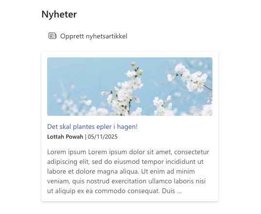

# Prosjektportalen 365 - 1.12.0 (November 2025)

**Versjon 1.12.0** adresserer følgende [issues](https://github.com/Puzzlepart/prosjektportalen365/issues?q=is%3Aissue+is%3Aclosed+milestone%3A1.12.0).
> **Nedlasting**: [v1.12.0](https://github.com/Puzzlepart/prosjektportalen365/releases)

---

Velkommen til versjon 1.12.0 av Prosjektportalen 365. I denne versjonen er det flere grunnleggende forbedringer og ny funksjonalitet som gjør det verdt å oppgradere til. Her er noen av høydepunktene:

- **[Prosjektportalen på engelsk](#prosjektportalen-på-engelsk)** - Prosjektportalen er nå tilgjengelig på engelsk!
- **[Arkivering ved faseendring](#arkivering-ved-faseendring)** - Ny funksjonalitet for å arkivere dokumenter og lister ved faseendring.
- **[Forbedringer på Bestillingsportal-integrasjonen](#forbedringer-på-bestillingsportal-integrasjonen)** - Flere større forbedringer for Bestillingsportal-integrasjonen.
- **[Prosjektnyheter](#prosjektnyheter)** - For publisering og visning av prosjektnyheter med mulighet til å opprette nyhetsartikler.
- **[Forbedret prosjekttidslinje](#forbedret-prosjekttidslinje)** - Prosjekttidslinjen senterer seg nå rundt prosjektets tidsforløp.
- **[Tilpasning av prosjektkort](#tilpasning-av-prosjektkort)** - Muligheter for å tilpasse informasjonen i prosjektkortet på forsiden av porteføljen.

## Prosjektportalen på engelsk

**Engelsk Prosjektportalen er her!** 🎉

Fra versjon **1.12** støtter Prosjektportalen nå installasjon på **engelsk**, slik at virksomheter med internasjonale behov kan bruke løsningen på sitt foretrukne språk. Installasjonen gjøres med parameteren `-Language English`, og norsk og engelsk kan eksistere side om side i samme organisasjon. [Les mer om engelsk Prosjektportalen her](https://github.com/Puzzlepart/prosjektportalen365/wiki/Engelsk-Prosjektportalen)

## Arkivering ved faseendring

Det er lagt til ny funksjonalitet i fasevelgeren som lar deg arkivere dokumenter og lister ved faseendring.

**Hovedfunksjoner:**

- **Arkivering i fasevelger**: Ved faseendring kan du velge spesifikke dokumenter fra Dokumentbiblioteket og lister på prosjektet som skal arkiveres
- **Arkiveringslogg på porteføljenivå**: En ny liste kalt `Arkiveringslogg` gir oversikt over alle dokumenter og lister som er loggført for arkivering på tvers av prosjekter
- **Webhook-integrasjon**: Ekstern arkivhåndtering via webhooks som automatisk håndterer arkivering av dokumenter og lister basert på loggføringen

**Slik bruker du det:**

1. Aktiver arkivering ved å skru på `Bruk arkivfunksjonalitet` i webdel-egenskapene for fasevelgeren
2. Konfigurer arkiv-webhook URL og autentisering (valgfri) for ekstern arkivhåndtering
3. Ved faseendring får du mulighet til å velge hvilke dokumenter og lister som skal arkiveres
4. Valgte elementer registreres i `Arkiveringslogg`-listen på porteføljenivå
5. Dersom konfigurert vil webhook kjøres automatisk og gå gjennom loggførte elementer for ekstern arkivbehandling

## Forbedringer på Bestillingsportal-integrasjonen

Det er gjort flere større forbedringer på Bestillingsportal-integrasjonen, noen av disse er:

- Ny funksjonalitet for å kreve tilgang til Bestillingsportalen - du kan nå styre hvem som skal ha tilgang til å bestille nye områder via en dedikert sikkerhetsgruppe
- Bedre feilhåndtering dersom bruker ikke har tilgang til Bestillingsportalen
- Bedre validering av påkrevde felt, skjemaet viser nå tydelig hvilke felt som mangler før bestilling kan sendes
- Mulighet for å laste opp bilde ved bestilling av nytt område
- Forbedret håndtering av feltkonfigurasjoner basert på valgt områdetype. Overskrifter og annen informasjon kan nå overstyres med egendefinerte verdier.
- Støtte for standardverdier på utløpsdato ved bruk av måneder-nedtrekksliste
- Automatisk generering av alias basert på områdenavn med bedre håndtering av spesialtegn
- Mulighet til å slette avviste bestillinger fra `Mine bestillinger` (ikke bare ikke-sendte og feilede)

## Prosjektnyheter

Den nye webdelen `Prosjektnyheter` gjør det mulig å publisere og vise nyheter direkte fra prosjektene. Webdelen viser nyheter som er publisert fra prosjektet, og gir mulighet til å opprette og redigere nyhetsartikler direkte fra prosjektsiden.

Det følger nå med en områdeside-mal, denn havner i `Templates` eller `Maler` mappen under `Områdesider`. Denne kan kopieres opp og brukere kan lage sine egne maler. Malene som kan velges mellom i `Prosjektnyheter`-webdelen henstes herfra. Det er viktig at personer som skal anvende malene har nødvendige tillatelser til å redigere fra denne mappen.

## Forbedret prosjekttidslinje

Prosjekttidslinjen er forbedret slik at den nå automatisk sentrerer seg rundt prosjektets tidsforløp (startdato til sluttdato). Dette gir en mer relevant og fokusert visning av prosjektets tidslinje, og gjør det enklere å få oversikt over prosjektets fremdrift uten å måtte navigere manuelt.

## Tilpasning av prosjektkort

Du kan nå tilpasse hvilken informasjon som vises i prosjektkortet på forsiden av porteføljen. I tillegg er det mulig å endre hvilke data som skal vises i de ulike feltene på kortet.

Du kan selv velge hvilke verdier som skal vises i:

- **Primærfeltet** og **sekundærfeltet** (midten av kortet)
- **Primærbruker** og **sekundærbruker** (i bunnen av kortet)

Feltene som kan velges hentes fra **`Prosjektkolonner`**, noe som betyr at også egendefinerte felter støttes.

Bildet under viser et eksempel på hvordan feltene brukes i prosjektkortet:

## Endringslogg

> For fullstendig endringslogg av alt som er med i denne utgivelsen, så kan du [trykke her for å lese mer](../CHANGELOG.md).

## Takk til dere

Sist, men ikke minst sier vi takk til alle som har bidratt til å melde inn feil, gitt oss verdifulle tilbakemeldinger og foreslått endringer.

Uten deres engasjement ville vi ikke vært i stand til å utvikle Prosjektportalen til det verktøyet det er i dag.

-Prosjektportalen-teamet
