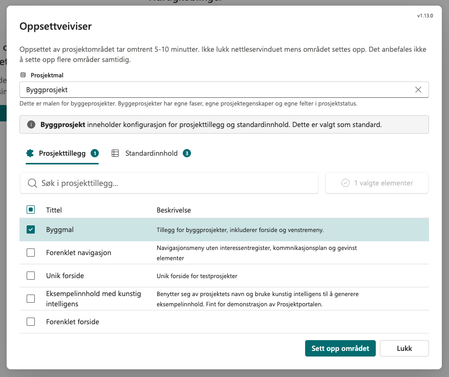
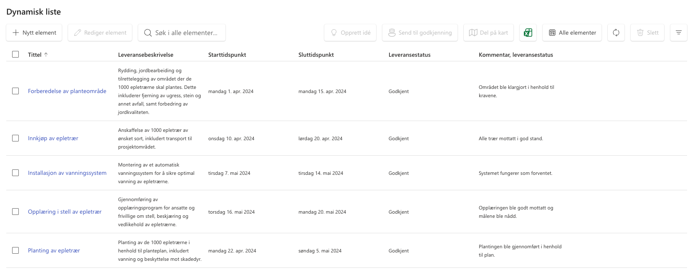
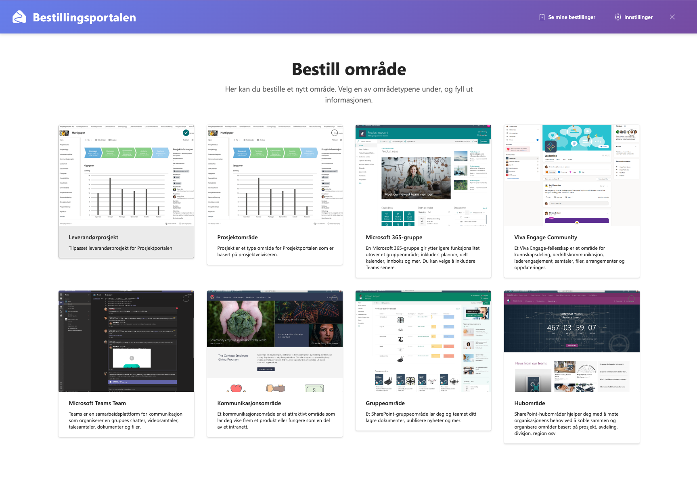
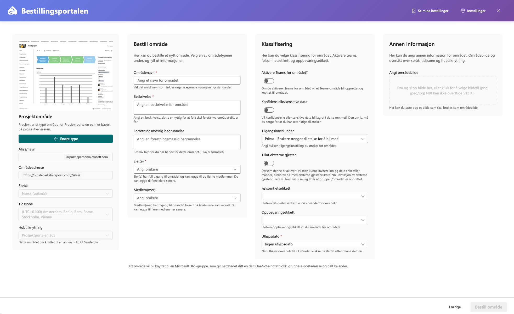
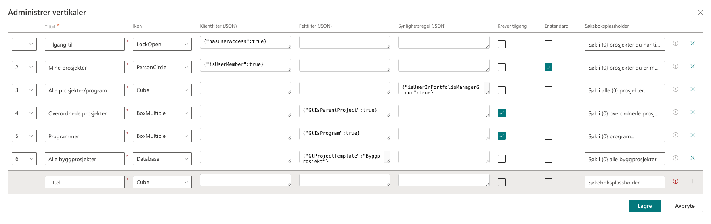
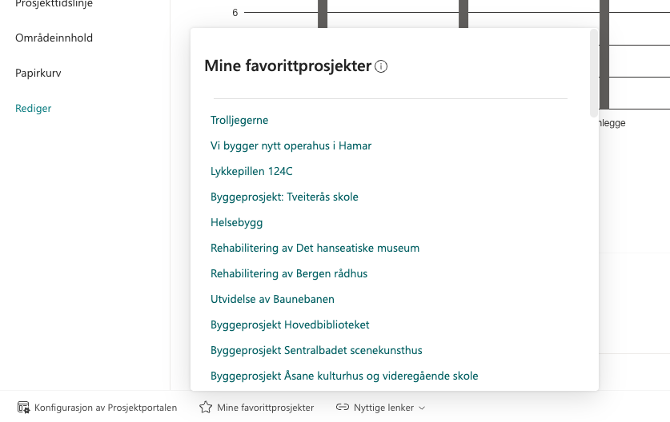

# Prosjektportalen 365 - 1.13.0 (April 2026)

**Versjon 1.13.0** adresserer følgende [issues](https://github.com/Puzzlepart/prosjektportalen365/issues?q=is%3Aissue+is%3Aclosed+milestone%3A1.13.0).
> **Nedlasting**: [v1.13.0](https://github.com/Puzzlepart/prosjektportalen365/releases)

---

Velkommen til versjon 1.13.0 av Prosjektportalen 365. I denne versjonen har vi fokusert på å modernisere sentrale deler av løsningen, forbedre Bestillingsportalen ytterligere og gi deg nye verktøy for å tilpasse og skalere porteføljen. Her er noen av høydepunktene i denne utgivelsen:

- **[Modernisert oppsettveiviser](#modernisert-oppsettveiviser)** - Oppsettveiviseren har fått et helt nytt grensesnitt med forbedret brukeropplevelse og avansert logg.
- **[Dynamisk listewebdel](#dynamisk-listewebdel)** - Ny fleksibel webdel for visning og redigering av data fra SharePoint-lister og dokumentbibliotek.
- **[Bestillingsportalen som Teams-app](#bestillingsportalen-som-teams-app)** - Bestillingsportalen er nå tilgjengelig som en Teams-app som erstatter PowerAppen.
- **[Forbedringer på Bestillingsportalen](#forbedringer-på-bestillingsportalen)** - Fullskjermmodus, støtte for underområder og flere forbedringer.
- **[Mal-spesifikt tidslinjeoppsett](#mal-spesifikt-tidslinjeoppsett)** - Støtte for forskjellige tidslinjeoppsett og standard tidslinjeelementer per prosjektmal.
- **[Konfigurerbare faner i Prosjektutlisting](#konfigurerbare-faner-i-prosjektutlisting)** - Fanene på forsiden av porteføljen kan nå tilpasses fra webdelens egenskapspanel.
- **[Forbedret multi-hub støtte](#forbedret-multi-hub-støtte)** - Samle prosjekter fra flere hubområder, inkludert på tvers av norske og engelske installasjoner.
- **[Tilgangsstyring for Prosjektportalen Assistenten](#tilgangsstyring-for-prosjektportalen-assistenten)** - Ny rollebasert tilgangsstyring for Prosjektportalen Assistenten.
- **[Kjør oppsettveiviseren på nytt](#kjør-oppsettveiviseren-på-nytt)** - Kjør oppsettveiviseren på nytt for et eksisterende prosjekt for å legge til ny funksjonalitet.
- **[Favorittprosjekter i Footer](#favorittprosjekter-i-footer)** - Rask tilgang til prosjekter du følger direkte fra footeren.

## Modernisert oppsettveiviser

Oppsettveiviseren har fått et helt nytt grensesnitt og betydelig forbedret brukeropplevelse. Veiviseren er nå mer oversiktlig, gir bedre tilbakemelding underveis i prosessen, og gjør det enklere å forstå hva som faktisk skjer når et nytt prosjekt settes opp.

**Hovedendringer:**

- Modernisert og mer brukervennlig grensesnitt
- Forbedret fremdriftsvisning som viser hvilket steg som pågår
- Mulighet for å se avansert logg for hvert steg i veiviseren, nyttig for feilsøking og for å forstå hva som settes opp
- Bedre håndtering av feil og forbigående problemer

## Dynamisk listewebdel

Den nye webdelen `Dynamisk listewebdel` gir deg en fleksibel og kraftig måte å vise data fra SharePoint-lister og dokumentbibliotek på, direkte på sidene dine. Webdelen støtter ulike visningsmoduser, filtrering, sortering og tilpassbare kolonner - og lar brukere opprette, redigere og slette elementer direkte fra webdelen.

**Hovedfunksjoner:**

- **Flere visningsmoduser**: Liste, enkeltvisning og dokumentbibliotek
- **Fleksibel datakilde**: Hent data fra nåværende prosjekt, hub-område eller egendefinert område
- **Mappehåndtering**: Full støtte for mapper i dokumentbibliotek, inkludert opprettelse og navigering
- **Prosjektmappe**: Automatisk opprettelse og filtrering av prosjektspesifikke mapper i dokumentbibliotek
- **Filtrer og sorter**: Grensesnitt for filtrering og sortering av data
- **Redigering**: Opprett, rediger og slett elementer direkte fra webdelen
- **Filopplasting**: Last opp filer til dokumentbibliotek med dra-og-slipp

## Bestillingsportalen som Teams-app

`Bestillingsportalen` er nå tilgjengelig som en Teams-app, slik at brukere kan bestille nye prosjekter og områder direkte fra Microsoft Teams. Teams-appen erstatter PowerAppen som tidligere fulgte med Bestillingsportalen og gir en mer integrert og moderne opplevelse.

Teams-appen bruker den nye fullskjermmodusen for Bestillingsportalen-skjemaet automatisk, slik at bestilleren får best mulig plass og oversikt underveis i bestillingen.

## Forbedringer på Bestillingsportalen

I tillegg til Teams-appen er det gjort flere forbedringer på Bestillingsportalen i denne versjonen:

- **Fullskjermmodus**: Ny fullskjerm-modus for Bestillingsportalen-skjema. Fullskjermmodus er på som standard og brukes automatisk i Teams-appen. Kan aktiveres/deaktiveres via egenskapspanelet.
- **Bestill underområder**: Støtte for å bestille underområder direkte fra et program/overordnet område via Bestillingsportalen-skjema. *Merk! Krever oppgradering av Bestillingsportalen.*
- **Dynamisk feltrendering**: Konfigurerbar feltrekkefølge og nivåplassering via `order`- og `level`-egenskapene, slik at skjemaet kan tilpasses mer fleksibelt per områdetype
- **Sortering av felter**: Feltene sorteres nå i rekkefølgen de er definert i egenskapspanelet
- **Standard metadata**: Mulighet for henting av standard metadata for prosjekttyper direkte i Bestillingsportalen-skjema
- **"Se mine bestillinger"-knapp**: Ny knapp i verktøylinjen i Bestillingsportalen-skuffen for rask tilgang til bestillingsstatus
- **Bedre validering**: Rettet en feil der standardverdien for synlighet (`DefaultVisibility`) fra prosjekttypen ikke ble tatt med ved lagring, samt bedre validering når samme bruker ble lagt til som både eier og medlem

## Mal-spesifikt tidslinjeoppsett

Nå kan du konfigurere standard tidslinjeelementer for ulike prosjektmaler, på samme måte som du konfigurerer standard Planner-oppgaver. Dette gir deg mulighet til å ha ulike tidslinjeoppsett og elementer for forskjellige typer prosjekter.

**Hovedfunksjoner:**

- **Standard tidslinjeelementer**: Definer standard tidslinjeelementer som automatisk opprettes når et nytt prosjekt settes opp
- **Mal-spesifikk konfigurasjon**: Ulike prosjektmaler kan ha forskjellige sett med tidslinjeelementer
- **Konfigurasjonsliste**: Ny liste `Tidslinjeelementer` på porteføljeområdet for å administrere standard elementer
- **Feltkontroll**: Velg hvilke felter som skal kopieres fra standard elementer ved hjelp av `GtLccFields`
- **Automatisk kopiering**: Elementer kopieres automatisk til `Tidslinjeinnhold` på hub-nivå ved prosjektopprettelse

**Slik fungerer det:**

1. **Opprett standard elementer**: I listen `Tidslinjeelementer` på porteføljeområdet oppretter du tidslinjeelementene du ønsker som standard
2. **Konfigurer malen**: I listen `Listeinnhold` legger du til en konfigurasjon av typen `Tidslinjekonfigurasjonselement` for malen din
3. **Angi kildedataliste**: Sett `GtLccSourceList` til `Tidslinjeelementer`
4. **Velg felter**: Spesifiser hvilke felter som skal kopieres i `GtLccFields` (f.eks. `Title,GtTimelineTypeLookup,GtDescription`)
5. **Opprett prosjekt**: Når et nytt prosjekt opprettes med denne malen, kopieres de konfigurerte elementene automatisk til prosjektets tidslinje

Dette følger samme mønster som Planner-konfigurasjon, og gir deg full kontroll over hvilke tidslinjeelementer som skal være standard for hver prosjektmal.

## Konfigurerbare faner i Prosjektutlisting

Prosjektlistens vertikale faner (tabs) er nå fullt konfigurerbare direkte fra webpartens egenskapspanel. Dette gir mye større fleksibilitet i hvordan forsiden av porteføljen kan settes opp, og åpner for helt nye bruksmønstre - for eksempel egne faner for porteføljer, programmer, favoritter eller spesifikke prosjekttyper.

Hver fane kan tilpasses med:

- **Tittel og ikon**
- **Klientfilter** (hvilke prosjekter fanen skal vise)
- **Feltfilter** (avanserte filtre på prosjektinformasjon)
- **Synlighetsregler** (hvem som ser fanen)
- **Tilgangskrav**
- **Plassholder for søkeboksen**

## Forbedret multi-hub støtte

Porteføljeoversikten har fått betydelige forbedringer rundt støtte for flere hubområder. En ny prosjektkolonne `Hubnavn` kan brukes til filtrering og visning av prosjekter basert på hvilket hubområde de tilhører.

I tillegg er det nå støtte for hubområder som har forskjellige språkinnstillinger, slik at norske og engelske prosjekter kan samles i én og samme oversikt. Dette gjør det vesentlig enklere for internasjonale virksomheter å få en felles oversikt på tvers av sine Prosjektportal-installasjoner.

## Tilgangsstyring for Prosjektportalen Assistenten

Det er innført ny tilgangsstyring for Prosjektportalen Assistenten basert på prosjektadministrasjonsroller. Dette gir mye mer granulær kontroll over hvem som skal ha tilgang til å bruke Assistenten i ulike prosjekter.

**Ny global innstilling `AssistantAccessMode` med tre moduser:**

- **`group`** *(standard)* - Eksisterende oppførsel, tilgangsstyring via sikkerhetsgrupper
- **`role`** - Rollebasert per prosjekt, styres via `Prosjektadministrasjonsroller`-listen
- **`both`** - Brukeren må tilfredsstille både gruppe- og rollesjekk for å få tilgang

Det er også introdusert en ny tilgang `AssistantAccess` som kan tilordnes roller i `Prosjektadministrasjonsroller`-listen.

## Kjør oppsettveiviseren på nytt

Det er lagt til ny funksjonalitet i `Prosjektinformasjon` for å kjøre `oppsettveiviseren` på nytt for et eksisterende prosjekt. Dette lar deg velge en mal, tillegg eller standardinnhold som skal legges til prosjektet i ettertid.

Dette er nyttig for:

- **Feilsøking** dersom noe ikke ble satt opp korrekt ved opprettelse
- **Å legge til ny funksjonalitet** i eksisterende prosjekter uten å måtte opprette et nytt prosjekt
- **Å ta i bruk nye tillegg** som er blitt tilgjengelige etter at prosjektet ble opprettet

## Favorittprosjekter i Footer

Det er lagt til en ny knapp i `Footer` som viser en liste over favorittprosjekter - prosjekter brukeren følger i porteføljen. Dette gir rask tilgang til prosjektene du jobber med til daglig, uten å måtte navigere via forsiden av porteføljen.

## Underområder i Prosjektinformasjon

En ny seksjon er lagt til i `Prosjektinformasjon` som viser underområder tilknyttet området. Dette gjør det enklere å få en samlet oversikt over programmer og overordnede prosjekter og deres underområder direkte fra prosjektsiden, uten å måtte navigere til egne administrasjonssider.

## Andre forbedringer verdt å nevne

I tillegg til høydepunktene over er det gjort en rekke forbedringer på tvers av løsningen:

- **Beregnede kolonner i aggregerte oversikter**: Støtte for beregnede kolonner i aggregerte oversikter, inkludert riktig visning ved eksport til Excel
- **Prosjektinformasjon som filtre**: Prosjektinformasjon (kolonner merket med `GtIsRefinable=true`) vises nå som filtre i aggregerte oversikter på linje med Prosjekttidslinje, gruppert i en egen seksjon i filterpanelet
- **Ytelsesforbedringer**: Prosjektutlisting, Prosjekttidslinje og aggregerte oversikter på samme side deler nå en felles cache for prosjektdata - kall mot `Prosjekter`-listen og tilhørende søk gjøres kun én gang per side
- **Forbedret Planner-stabilitet**: Automatisk gjenforsøk ved forbigående feil, samt bedre deduplisering av oppgaver og feillogging
- **Last ned uten hub-tilgang**: Prosjekter kan nå lastes inn selv om brukeren ikke har tilgang på hub, og viser da prosjektinformasjon fra lokale data med tydelige feilmeldinger for status og tidslinje
- **Forbedret hent dokumentmal**: `Hent dokumentmal`-dialogen defaulter nå målmappen til mappen brukeren befinner seg i, og mapper kan navigeres med enkeltklikk
- **Nye kolonner i Prosjekter-listen**: `Prosjekttillegg` og `Listeinnhold` lagrer navnene på valgte tillegg og listeinnhold ved opprettelse av prosjektet
- **Forbedret sammendrag i versjonsvarsling**: Oversikten over siste versjon av Prosjektportalen inkluderer nå et sammendrag av nyheter, i tillegg til lenke til fullstendige release notes

## Fjernet funksjonalitet

- **Porteføljeinnsikt-siden er fjernet**: Porteføljeinnsikt-siden og alle tilhørende komponenter er fjernet, inkludert `Grafkonfigurasjon`-listen, `Egendefinerte diagrammer`-biblioteket, tilhørende innholdstyper, områdefelt og navigasjonslenker. Eksisterende installasjoner ryddes opp automatisk ved oppgradering.
- **Innstillingen `Vis kommandolinje`** er fjernet fra webdelen for oversikt over underområder i program - innstillingen var forvirrende og styrte ikke selve visningen av kommandolinjen.
- **Innstillingen `Vis grupperingsvalg`** er fjernet fra porteføljeoversikt og oversikt over underområder i program. Innstillingen hørte til gammel funksjonalitet og gjorde ingenting.

## Endringslogg

> For fullstendig endringslogg av alt som er med i denne utgivelsen, så kan du [trykke her for å lese mer](../CHANGELOG.md).

## Takk til dere

Sist, men ikke minst sier vi takk til alle som har bidratt til å melde inn feil, gitt oss verdifulle tilbakemeldinger og foreslått endringer.

Uten deres engasjement ville vi ikke vært i stand til å utvikle Prosjektportalen til det verktøyet det er i dag.

-Prosjektportalen-teamet
