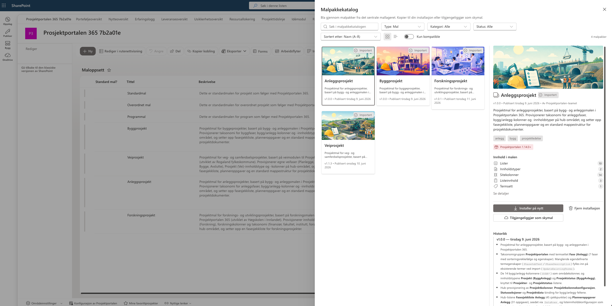
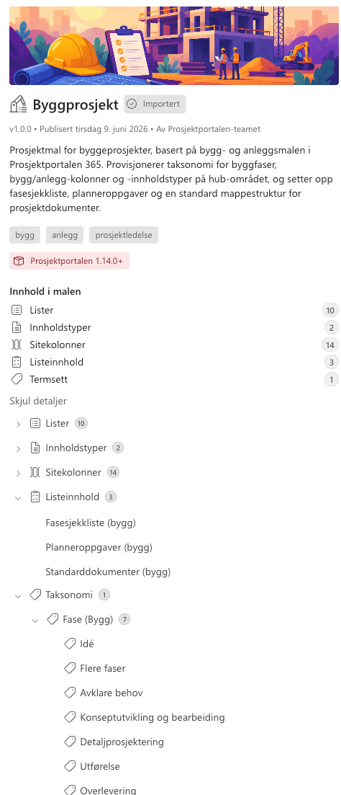

# Prosjektportalen 365 - 1.14.0 (TBA)

**Versjon 1.14.0** adresserer følgende [issues](https://github.com/Puzzlepart/prosjektportalen365/issues?q=is%3Aissue+is%3Aclosed+milestone%3A1.14.0).
> **Nedlasting**: [v1.14.0](https://github.com/Puzzlepart/prosjektportalen365/releases)

---

Velkommen til versjon 1.14.0 av Prosjektportalen 365. I denne versjonen er hele malverket oppdatert til Prosjektveiviseren versjon 6, vi introduserer den sentrale malpakkekatalogen - en helt ny måte å distribuere maler og innhold på - og vi har modernisert hvordan prosjektområder settes opp ved å flytte provisjoneringen fra site scripts til JSON-malene. Her er noen av høydepunktene i denne utgivelsen:

- **[Prosjektveiviseren versjon 6](#prosjektveiviseren-versjon-6)** - Hele malverket er oppdatert til Prosjektveiviseren v6, med nye fasesjekkpunkter og prosjektoppgaver, nytteterminologi, nye styringsparametere og nye dokumentmaler.
- **[Sentral malpakkekatalog](#sentral-malpakkekatalog)** - Bla i og installer malpakker direkte fra hubområdet, uten å vente på en ny Prosjektportalen-release.
- **[Bygg- og anleggsinnhold som malpakker](#bygg--og-anleggsinnhold-som-malpakker)** - B&A-innholdet er flyttet ut av kjernen og installeres nå fra katalogen ved behov.
- **[Interessentgrupper i termlageret](#interessentgrupper-i-termlageret)** - Nytt felles taksonomifelt for interessentgrupper, vedlikeholdt sentralt i termlageret.
- **[Fra site scripts til prosjektmaler](#fra-site-scripts-til-prosjektmaler)** - Innholdstyper og SPFx-utvidelser provisjoneres nå fra JSON-malene i stedet for via site scripts.
- **[Bestillingsportalen er flyttet til eget repo](#bestillingsportalen-er-flyttet-til-eget-repo)** - Bestillings-webdelen distribueres nå separat. **Krever en bestemt oppgraderingsrekkefølge.**

## Prosjektveiviseren versjon 6

Hele malverket er oppdatert til [Prosjektveiviseren v6](https://prosjektveiviseren.digdir.no/) (Digdir, juni 2026). Oppdateringen omfatter fasesjekkpunkter, prosjektoppgaver, terminologi, styringsparametere, dokumentmaler og fasetekster - med en oppgraderingssti som lar eksisterende virksomheter ta i bruk det nye innholdet i sitt eget tempo. [#1044](https://github.com/Puzzlepart/prosjektportalen365/issues/1044)

**Nytt innhold side om side med det eksisterende:**

v6-fasesjekkpunktene (63) og v6-prosjektoppgavene (26, med beskrivelser og Planner-sjekklister) provisjoneres i nye hub-lister (`Lists/Fasesjekklistev6`, `Lists/Planneroppgaverv6`) med de opprinnelige visningsnavnene, mens de eksisterende listene beholdes urørt som «… (tidligere)». Virksomheten velger selv innholdssett per prosjektmal via `Listeinnhold` - ren installasjon får v6 som standard, mens oppgradering beholder virksomhetens eksisterende valg.

**Terminologi: gevinst blir nytte:**

Alle brukervendte tekster følger nå v6-/DFØ-terminologien: nyttevirkninger, nyttestyring, Nytteoversikt, Nytteanalyse og plan for nyttestyring, og Nytteoppnåelse. Rollefeltene heter nå «Nytteeier» (tidligere Gevinstansvarlig) og «Nytteansvarlig» (tidligere Gevinsteier). Interne feltnavn, liste-URL-er, sidefilnavn og lagrede data er uendret, slik at eksisterende rapporter, integrasjoner og tilpasninger fortsetter å virke.

**Bærekraft og omfang som styringsparametere:**

Prosjektstatus har fått to nye statusseksjoner - omfang (`GtStatusScope`) og bærekraft (`GtStatusSustainability`) - med kommentarfelt, valgverdier og fargekonfigurasjon, i tråd med v6s sju styringsparametere.

**v6-dokumentmaler:**

`Malbibliotek/Fra Prosjektveiviseren` inneholder nå de 11 v6-malene fra Digdir, inkludert «Plan for nyttestyring» og den nye malpakken for små prosjekter (forenklet styringsdokument/prosjektkanvas). Det gamle malsettet (v2.2–v5.0) provisjoneres ikke lenger - eksisterende filer hos oppgraderte virksomheter beholdes og kan slettes manuelt.

**v6-fasetekster i termlageret:**

Nye installasjoner får v6s undertekster og fasebeskrivelser i termlageret på begge språk. Fasetermene oppdateres ikke ved oppgradering - virksomheter som ønsker de nye tekstene kan oppdatere `PhaseSubText`/`PhaseDescription` manuelt i termlageret.

**Ved oppgradering:**

- `-Upgrade` omdøper hub-listene og berørte konfigurasjonsrader på plass - ingen duplikater, og maloppsettene beholder koblingene sine
- `UpgradeAllSitesToLatest.ps1` har fått en ny valgfri bryter `-GevinstTilNytte` som oppdaterer visningsnavn fra gevinst- til nytteterminologi på eksisterende prosjektområder. Bryteren er opt-in - uten den beholder prosjektområdene dagens terminologi
- Innholdssettvalget per prosjektmal (`Listeinnhold`) beholdes som det er - virksomheten bytter til v6-innholdet når den selv er klar

> **Merk:** Arbeidsdokumentasjon og revisjonsspor for v6-oppdateringen finnes i `docs/prosjektveiviseren-v6/`.

## Sentral malpakkekatalog

En annen stor nyhet i denne versjonen er den sentrale malpakkekatalogen. Administratorer kan nå bla i og installere malpakker - maler, prosjekttillegg og innholdspakker - direkte fra hubområdet via den nye `Malpakkekatalog`-kommandoen.

Pakkene hentes live fra det sentrale katalog-repoet. Det betyr at nye maler og innholdspakker kan publiseres og tas i bruk uten å måtte vente på en ny Prosjektportalen-release - katalogen er alltid oppdatert.

**Hovedfunksjoner:**

- **Rik pakkeinformasjon**: Hver pakke presenteres med skjermbilder, innholdsoversikt og versjonshistorikk, slik at du vet hva du får før du installerer
- **Avhengigheter og krav**: Katalogen viser hvilke krav pakken stiller - minimumsversjon av Prosjektportalen, Bestillingsportalen, Microsoft Entra og tilgjengelige språk
- **Kompatibilitetssjekk**: Importflyten sjekker at pakken er kompatibel med miljøet ditt før noe installeres
- **Full provisjonering**: Import av en pakke provisjonerer huben med innholdstyper, felt, lister, taksonomi, tillegg og listeinnhold - med stegvis fremdriftsvisning underveis
- **Skymaler**: Maler kan publiseres som skymaler og settes opp direkte i oppsettveiviseren fra `.pppkg`, uten at malen først må installeres i hubområdet

<!--  -->

<!--  -->

## Bygg- og anleggsinnhold som malpakker

Som en direkte følge av malpakkekatalogen er bygg- og anleggsspesifikt innhold flyttet ut av kjernen. B&A-spesifikke lister, kolonner, innholdstyper og taksonomi er fjernet fra standardmalene, og gjøres i stedet tilgjengelig som valgfrie malpakker (`Byggprosjekt`, `Anleggsprosjekt`) i katalogen.

Dette gir en slankere standardinstallasjon for alle som ikke bruker B&A-funksjonaliteten, og et tydeligere skille mellom kjerne og bransjeinnhold.

> **Merk:** Eksisterende prosjekter påvirkes ikke. Nye miljøer som trenger B&A-funksjonalitet installerer den nå fra malpakkekatalogen.

## Interessentgrupper i termlageret

`Interessentgruppe` på `Interessentregister` er konvertert til et nytt multi-select taksonomifelt `GtStakeholderGroups`, med verdier vedlikeholdt sentralt i termlageret under `Prosjektportalen › Interessentgrupper`.

Det nye feltet erstatter de tidligere Choice-feltene `GtStakeholderGroup` og B&A-varianten `GtBAStakeholderGroup`, som er slått sammen til ett felles felt. Tidligere måtte endringer i gruppevalgene skriptes ut til alle prosjektområder - nå vedlikeholdes verdiene ett sted, og endringene er umiddelbart tilgjengelige overalt.

**Ved oppgradering:**

- Eksisterende verdier fra de gamle Choice-feltene migreres automatisk til det nye taksonomifeltet per prosjektområde
- Kundetilpassede choice-verdier opprettes som nye termer i termsettet
- De gamle feltene skjules (`Hidden=TRUE`), men data bevares

> **Merk:** Etter oppgradering bør tenant-administrator regenerere `SearchConfiguration.xml` fra sitt miljø dersom `GtStakeholderGroups` skal brukes som refiner eller i aggregerte oversikter. Det nye feltet fungerer uten denne endringen for visning og redigering i listen.

<!--  -->

## Fra site scripts til prosjektmaler

Provisjoneringen av nye prosjektområder er modernisert: både innholdstyper og SPFx-utvidelser defineres nå i JSON-malene og legges inn av oppsettveiviseren, i stedet for via site scripts ved områdeopprettelse. Området-designet (`Prosjektområde`) består nå kun av to site scripts - `Regionale innstillinger` og `Setup extension` - mot 20 ved starten av denne versjonssyklusen.

**Innholdstyper fra malene:**

Innholdstypene opprettes nå direkte fra JSON-malene med faste innholdstype-ID-er, via `sp-js-provisioning` `1.3.8`. De 15 site scriptene som tidligere kun opprettet tomme innholdstyper er fjernet, slik at innholdstypene forvaltes ett sted - i malene - med fullstendige metadata og feltreferanser.

**Utvidelser fra malene:**

SPFx-utvidelsene som legges inn på prosjektområder defineres nå under `CustomActions` i `Standardmal` og `Programmal`:

- **Oppgradering av prosjekter** (`ProjectUpgrade`) - varsler om og kjører oppgradering av prosjektområdet etter en ny release
- **Malvelger** - kommandoen `Hent dokumentmal` i dokumentbibliotek
- **Footer** - bunnteksten på prosjektområder med hjelpeinnhold, versjonsinformasjon og favorittprosjekter

Utvidelser som allerede finnes på området gjenbrukes basert på tittel, slik at områder opprettet med eldre områdedesign ikke får duplikater. Gamle site scripts i tenanten kan bli liggende uten opprydding, og `Malvelger` sin malbibliotek-innstilling settes fortsatt per prosjektmal.

**Forbedret avansert logg:**

Den avanserte loggen i oppsettveiviseren er også forbedret. Hvert element som legges inn - lister, innholdstyper, sider, felter, navigasjonslenker og utvidelser - får nå sin egen logglinje, fullførte steg kan alltid ekspanderes for innsyn, og dersom det oppstår en feil under oppsettet vises feilen sammen med den avanserte loggen i stedet for i en egen feildialog.

<!--  -->

> **Merk:** Utvidelsene legges nå inn av prosjektmalen. Tilpassede maler som ikke inkluderer `CustomActions`-delen, samt områder som settes opp uten mal, vil ikke lenger få disse utvidelsene automatisk. Kopier `CustomActions`-blokken fra `Standardmal` inn i egne maler ved behov.

## Bestillingsportalen er flyttet til eget repo

Bestillings-webdelen er **flyttet ut av Prosjektportalen** og vedlikeholdes nå i [Bestillingsportalen-repoet](https://github.com/Puzzlepart/bestillingsportalen), i pakken `bp-provision-web-parts` fra Bestillingsportalen 1.0.0. Komponent-id-en er beholdt, så eksisterende `Bestillingsportalen.aspx`-sider virker som før når den nye pakken er distribuert.

Dette gjør at Bestillingsportalen kan videreutvikles og gis ut i eget tempo, uavhengig av Prosjektportalens releasesyklus. Forbedringene som tidligere var planlagt som en del av 1.14.0 - standard metadata fra prosjekttypen, ekskludering av områdetyper per instans og tydeligere hubhåndtering - følger nå Bestillingsportalen 1.0.0 i stedet.

> **Viktig - rekkefølgen på oppgraderingen er obligatorisk.** Distribuer **først** denne Prosjektportalen-versjonen, og **deretter** Bestillingsportalen ≥ 1.0.0 i samme vedlikeholdsvindu. Appkatalogen avviser to pakker med samme komponent-id, så begge kan ikke ligge der samtidig. I mellomtiden viser `Bestillingsportalen.aspx` meldingen «finner ikke komponenten». Se `Upgrade.md` i Bestillingsportalen-repoet for detaljer.

Dette er verdt å merke seg for tenanter som bruker bestillingsflaten:

- **Eksisterende sikkerhetsgrupper beholdes, men provisjoneres ikke lenger**: Malen oppretter ikke lenger `Bestillingsportalen`-gruppen på nye porteføljer (gruppen tilhører nå Bestillingsportalen-produktet). Eksisterende grupper røres ikke og fortsetter å virke — den nye webdelen bruker gruppetittelen som standard tilgangsstyring. *Merk at gruppen heter `Provision portal` på eksisterende engelskspråklige installasjoner; tittelen kan overstyres med webdel-egenskapen `provisionAccessGroupTitle`.* Skal tilgangsstyring brukes på en ny portefølje, opprettes gruppen manuelt — se Bestillingsportalens `Configuration-guide.md`.
- **Eksisterende sider beholdes**: Sider som allerede finnes røres ikke. Nye porteføljer får derimot ikke lenger `Bestillingsportalen.aspx` provisjonert av malen - siden legges opp der bestillingsflaten skal brukes.
- **Sentral URL håndteres av Bestillingsportalen**: Bestillingsportalens eget installasjonsskript registrerer instans-URL-er i tenant-innstillingen `bp_ProvisionUrls`, som Teams-appen og webdelen bruker. Prosjektportalens installasjonsskript setter ingen slik innstilling.
- **Idémodulen**: Den innebygde bestillingsknappen er fjernet. Fasen `Bestill område` vises som en vanlig fane.

## Andre forbedringer verdt å nevne

I tillegg til høydepunktene over er det gjort en rekke forbedringer på tvers av løsningen:

- **Standard tidsramme i Prosjekttidslinje**: Konfigurerbar standard tidsramme (`Standard startdato` og `Standard sluttdato`) i egenskapspanelet for `Prosjekttidslinje`-webdelen i porteføljen, slik at administrator kan velge hvor langt tilbake og frem i tid tidslinjen skal vises som standard
- **Renere visning av taksonomifelt**: Termsett-/taksonomifelt i aggregerte oversikter vises nå som rene etiketter i stedet for rått søkeresultatformat med GUID-er, og flerverdier vises som separate merker
- **Hierarkiske filtre**: Felter med datatype `Tags` hvor verdiene har overordnede termer vises nå som et innrykket, sammenleggbart hierarki i filterpanelet i stedet for som flate tekststrenger
- **Operatorer i Feltfilter**: `Feltfilter` for vertikale faner i `Prosjektutlisting` støtter nå operatorene `$ne` (ikke lik), `$in` (én av) og `$nin` (ingen av) i tillegg til ren likhet
- **Oppdatert PnP.PowerShell**: Bundlet `PnP.PowerShell` er oppdatert til `3.2.0`, og versjonskravet er samlet i det felles installasjonsskriptet slik at installasjons- og release-flyten bruker samme kilde

## Endringslogg

> For fullstendig endringslogg av alt som er med i denne utgivelsen, så kan du [trykke her for å lese mer](../CHANGELOG.md).

## Takk til dere

Sist, men ikke minst sier vi takk til alle som har bidratt til å melde inn feil, gitt oss verdifulle tilbakemeldinger og foreslått endringer.

Uten deres engasjement ville vi ikke vært i stand til å utvikle Prosjektportalen til det verktøyet det er i dag.

-Prosjektportalen-teamet
