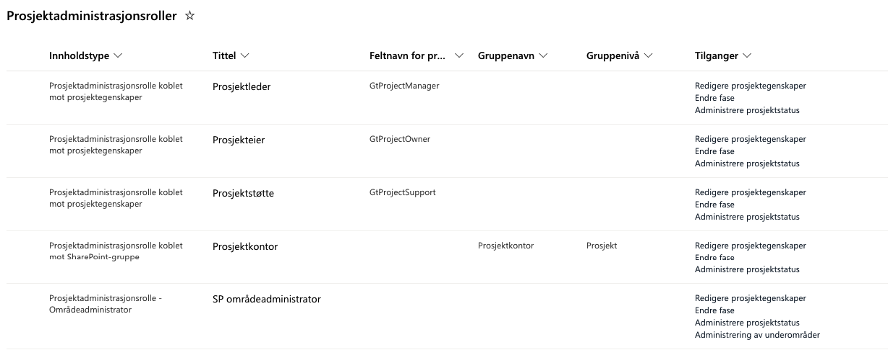
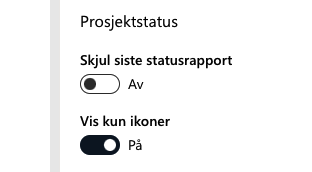
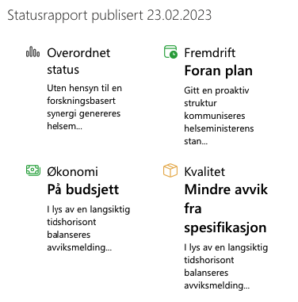
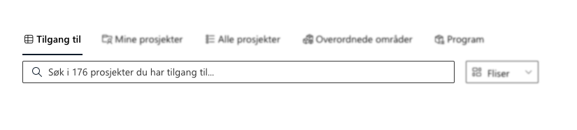
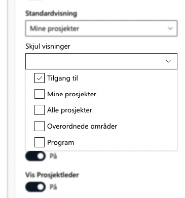
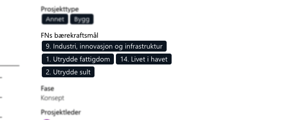
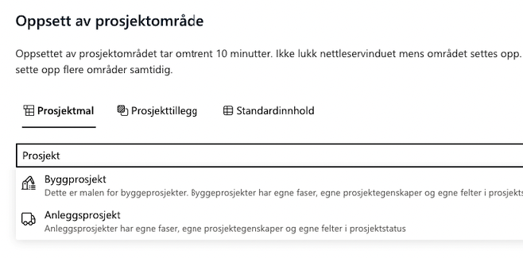
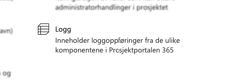
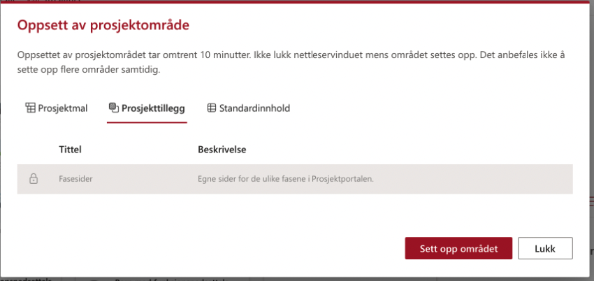

# Prosjektportalen 365 - 1.8.0 (Februar 2023)

**Versjon 1.8.0** adresserer følgende [issues](https://github.com/Puzzlepart/prosjektportalen365/issues?q=is%3Aissue+is%3Aclosed+milestone%3A1.8).
> **Nedlasting**: [v1.8.0](https://github.com/Puzzlepart/prosjektportalen365/releases)

---

Velkommen til versjon 1.8.0 av Prosjektportalen 365. I denne versjonen er det flere grunnleggende endringer som gjør det verdt å oppgardere til. Her er noen av høydepunktene:

- **[Rettighetsstyring av komponenter](#rettighetsstyring-av-komponenter)** - Styre hvilke roller som har tilgang til hva
- **[Overordnede prosjekter i prosjektinformasjon](#overordnede-prosjekter-i-prosjektinformasjon)** - Visning av overordnede prosjekter som prosjektet er tilknyttet til
- **[Statusrapport i prosjektinformasjon](#statusrapport-i-prosjektinformasjon)** - Kjente ikoner fra statusrapport vises nå på prosjektforsiden
- **[Flere Planner planer](#flere-planner-planer)** - Opprett prosjekter med flere Planner planer
- **['Tilgang til'-vertikal på forsiden](#tilgang-til-vertikal-på-forsiden)** - Mulighet for å se alle prosjekter du har tilgang til
- **[Integrasjon av bygg- og anleggsmodulen](#integrasjon-av-bygg--og-anleggsmodulen)** - Modulen er nå en del av standardpakken
- **[Logging av hendelser](#logging-av-hendelser)** - Ny liste for logging av hendelser og feil

---

## Mulighetsmatrise

Det er nå lagt til en ny matrise for muligheter, denne følger nå som med standard og er tilgjengelig på statusrapporten.

## Rettighetsstyring av komponenter

Vi har lagt til mulighet for å styre hvilke roller som skal ha tilgang til å redigere webdeler og komponenter i de ulike webdelene. Her kan man angi hva en person som står som Prosjekteier eller Prosjektleder skal ha tilgang til, samt SharePoint grupper.

Funksjoner som kan delegeres er:

- redigere prosjektinformasjon
- endre fase
- administrere prosjektstatus
- administrering av underområder

Listen, `Prosjektadministrasjonroller`, er tilgjengelig i konfigurasjonssiden for Prosjektportalen under 'Avansert'. Roller som kommer med ut av boksen som kan tildeles rettigheter er:

Det er også mulig å legge til flere roller, eksempel: 'Gevinstansvarlig' eller grupper som er definert på porteføljenivå under 'Tillatelseskonfigurasjon' i Prosjektportalens administrasjonsområde.

## Overordnede prosjekter i prosjektinformasjon

Det er nå mulig å vise prosjekter som er overordnet i Prosjektinformasjon webdelen. Dette kan slås av ved å redigere egenskapene til webelen.

## Statusrapport i prosjektinformasjon

Det er lagt inn visning av statusrapporten på prosjektets forside. Som standard vises disse som ikoner (med statusfarge). Forhåndsvisning av tittel og kommentar får du ved å holde musepekeren over ikonet.

Ved å redigere webdelen er det mulig å vise statusene med kommentarer dersom 'Vis kun ikoner' er avslått. Derifra kan du velge 'Avkort kommentarer' - da vil tekstfeltene vises med mindre eller mer tekst. Forhåndsvisning ved å holde musepekeren over vil fortsatt vise hele teksten. Det er også mulig å skjule statusrapport.

## Flere Planner planer

Man kan nå opprette prosjekter med mer enn en Planner plan. Alle valgte planneroppgaver vil bli opprettet og vil bli synlige på 'Oppgaver' siden fra venstremeny i prosjekt. Det er også mulig å angi et spesifikt plannav.

Dette kan gjøres på følgende måte:

1. Opprette to eller flere ulike mal-lister som danner utgangspunkt for to eller flere planner planer
2. Opprette element i Listeinnhold listen
3. Velg to eller flere planneroppgaver fra 'Oppsett av prosjektområde' dialog

## 'Tilgang til'-vertikal på forsiden

Tidligere var det kun mulig å se prosjekter på portalforsiden der du som bruker var lagt inn i Microsoft 365-gruppen for prosjektet. Med `Tilgang til` ser du også alle prosjekter du har blitt tildelt tilgang til via SharePoint-grupper.

Man kan nå styre hvilke visninger/vertikaler man ønsker å skjule som en global innstilling.

## FNs bærekraftsmål

En gledelig nyhet for mange var det nye feltet for `FNs bærekraftsmål`. Det er nå mulig å knytte prosjekter opp mot `FNs bærekraftsmål`. Dette gjøres ved å redigere prosjektinformasjonen.

Dersom feltet ikke er synlig i prosjektet, kan du kjøre en synkronisering av prosjektinformasjon. Når synkroniseringen er ferdig vil feltet dukke opp ved redigering av prosjektinformasjon.

## Konfigurasjon av tekstfarge på prosjekttidslinje

Noen ganger opplevde brukere at tidslinje-elementer ble farget slik at teksten ble uleselig. Vi har derfor gjort det mulig å velge egne tekstfarger på elementer i tidslinjen.

For å endre tekstfarger eller konfigurere oppsettet til prosjekttidslinjen kan man gå til isten, `Tidslinjekonfigurasjon`, som er tilgjengelig i konfigurasjonssiden for Prosjektportalen under 'Porteføljekonfigurasjon'.

## Integrasjon av bygg- og anleggsmodulen

Bygg- og anleggsmodulen er nå tatt inn som en integrert del av Prosjektportalen 365. Det innebærer at denne blir automatisk installert når Prosjektportalen 365 installeres.

Dette vil være synlig som to nye maler, en for byggeprosjekter og en for anleggsprosjekter. I tillegg kommer det nye termsett, ny statusrapport, og nye oppgave- og fasesjekklister for disse prosjektmalene.

For brukere som har skal oppgradere fra tidligere versjon og ønsker bygg- og anleggsinnhold, må følgende parameter legges til: `-IncludeBAContent`

## Logging av hendelser

Det er opprettet en ny liste hvor systemet lagrer hendelser som oppstår under oppsett og endringer i administrasjon av prosjekter. I praksis logges nå feil under prosjektopprettelse samt faseendringer og synkronisering av prosjektinformasjon.

Listen, `Logg`, er tilgjengelig i konfigurasjonssiden for Prosjektportalen under 'Avansert'.

## Unike fasesider (Prosjekttillegg)

I versjon 1.6 introduserte vi dynamiske prosjekt-forsider for å kunne ha egne prosjekt-forsider for hver fase. Unike fasesider er nå tilgjengelig som valgbart prosjekttillegg og kommer med som standard, men må slåes på.

Tillegget inneholder sider for standard fasene, Konsept, Planlegge, Gjennomføre, Avslutte og Realisere. Denne kan brukes som et utgangspunkt til eget oppsett, hvor dere definerer deres egne faser og oppbygninger av de ulike sidene slik at hver fase blir unik. Tillegget er skjult som standard og må slåes på dersom det skal dukke opp i 'Oppsett av prosjektområde dialog.

---

# Verdt å nevne fra versjon 1.7

## Integrert hjelpeinnhold

Dokumentasjon og hjelpeinnhold er nå tilgjengelig direkte i SharePoint. Her vil det være synlig en knapp oppe til høyre (Hjelp tilgjenglig) som viser en dialog med innhold fra Prosjektportalen brukermanual. Denne er dynamisk basert på hvilke side du står på. Dersom du står på Porteføljeforsiden vil du få opp dokumentasjon for Porteføljeforsiden.

Innholdet i dialogen er også tilpasningsvennlig, det er en egen liste, `Hjelpeinnhold`, som er tilgjengelig i konfigurasjonssiden for Prosjektportalen under 'Porteføljekonfigurasjon'. Her kan du legge til eget innhold som skal vises i dialogene på egne sider eller de vanlige sidene som følger med Prosjektportalen. Det er også mulig ha flere faner i dialogene med forskjellig innhold.

## PnP.PowerShell

Vi har nå oppgradert til siste modul av PnP.PowerShell, tidligere SharePointPnPPowerShellOnline. Denne endringen gjelder de som installerer eller oppgraderer Prosjektportalen. Oppgraderingen av PnP.PowerShell modulen krevde en helomvendig av alle skript knyttet til installasjon og oppgradering, dette gjorde det nå mulig å installere/oppgradere for Mac brukere.

Største endringen dette medfører er hvordan man autentiserer seg og for tillatelser på, i form av delegerte tillatelser som må gis PnP.PowerShell. Delegerte tillatelser betyr at appen ikke får tilgang til noe i seg selv, men får kun tilganger dersom brukeren som kaller appen (altså den som kjører PnP.Powershell-skript) har de nødvendige rettighetene.

---
## Endringslogg

> For fullstendig endringslogg av alt som er med i denne utvigelsen, så kan du [trykke her for å lese mer](../CHANGELOG.md#180---28022023).

## Takk til dere

Sist men ikke minst sier vi takk til alle som har bidratt til å melde inn bugs og feil, gi oss verdifulle tilbakemeldinger og foreslå endringer.

Uten deres engasjement ville vi ikke vært i stand til å utvikle Prosjektportalen til det verktøyet det er i dag.

-Prosjektportalen-teamet
