# Prosjektportalen 365 - 1.8.0 (Februar 2023)

**Versjon 1.8.0** adresserer følgende [issues](https://github.com/Puzzlepart/prosjektportalen365/issues?q=is%3Aissue+is%3Aclosed+milestone%3A1.8).
> **Nedlasting**: [v1.8.0](https://github.com/Puzzlepart/prosjektportalen365/releases)

---

Velkommen til versjon 1.8.0 av Prosjektportalen 365. I denne versjonen er det flere grunnleggende endringer som gjør det verdt å oppgardere til. Her er noen av høydepunktene:

- **[Dynamiske matriser i prosjektstatus](#dynamiske-matriser)** - Risiko- og mulighetsmatrisene er blitt mer fleksible
- **[Rettighetsstyring av komponenter](#rettighetsstyring-av-komponenter)** - Styre hvilke roller som har tilgang til hva
- **[Søkeboks i prosjektoppsett dialog](#søkeboks-i-prosjektoppsett-dialog)** - Det er nå støtte for søk i prosjektoppsett dialog
- **[Overordnede prosjekter i prosjektinformasjon](#overordnede-prosjekter-i-prosjektinformasjon)** - Visning av overordnede prosjekter som prosjektet er tilknyttet til
- **[Statusrapport i prosjektinformasjon](#statusrapport-i-prosjektinformasjon)** - Kjente ikoner fra statusrapport vises nå på prosjektforsiden
- **[Flere Planner planer](#flere-planner-planer)** - Opprett prosjekter med flere Planner planer
- **['Tilgang til'-vertikal på forsiden](#tilgang-til-vertikal-på-forsiden)** - Mulighet for å se alle prosjekter du har tilgang til
- **[Bygg- og anleggsmodulen](#bygg--og-anleggsmodulen)** - Modulen er nå en del av standardpakken
- **[Logging av hendelser](#logging-av-hendelser)** - Ny liste for logging av hendelser og feil

---

## Dynamiske matriser

Risiko- og mulighetsmatrisene er blitt mer fleksible. Det er nå mulig å justere størrelse og farger. Matrisene kan også settes til å bruke hele kolonnebredden i statusrapportene eller selvvalgt bredde. Det er også mulig å overstyre overskriftene til sannsynlighet og konsekvens aksene.

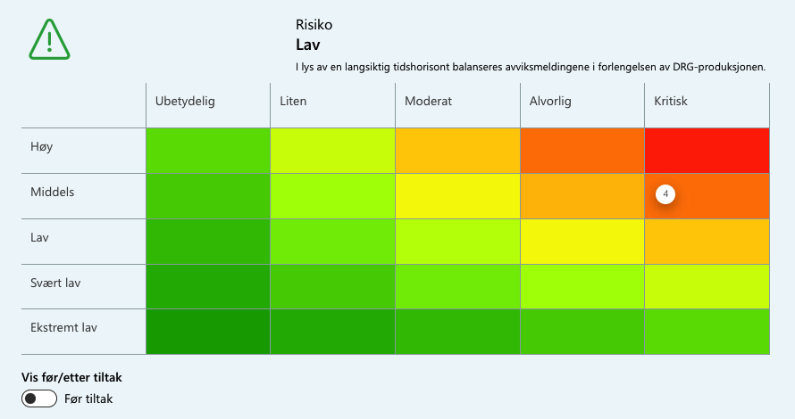

Endringene gjøres ved å klikke på "Rediger" på Prosjektstatus siden.

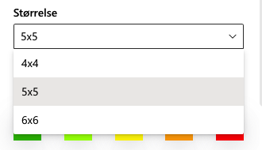 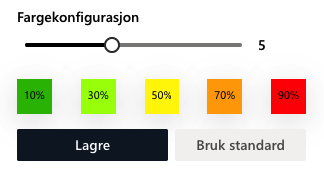

## Mulighetsmatrise

Skrive noe om denne?

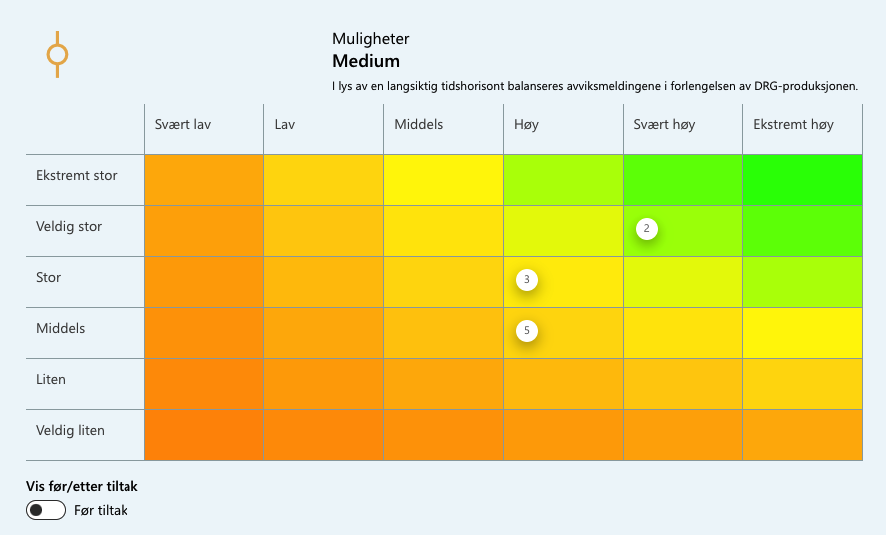

## Rettighetsstyring av komponenter

Vi har lagt til mulighet til å styre hvilke roller som skal ha tilgang til å redigere webdeler og komponenter i webdelene. Listen, `Prosjektadministrasjonroller`, er tilgjengelig i konfigurasjonssiden for Prosjektportalen under 'Avansert'.

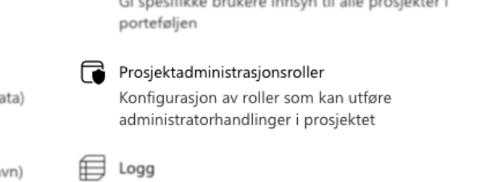

Funksjoner som kan delegeres er:

- redigere prosjektinformasjon
- endre fase
- administrere prosjektstatus
- administrering av underområder

Roller som kommer med ut av boksen som kan tildeles rettigheter er:

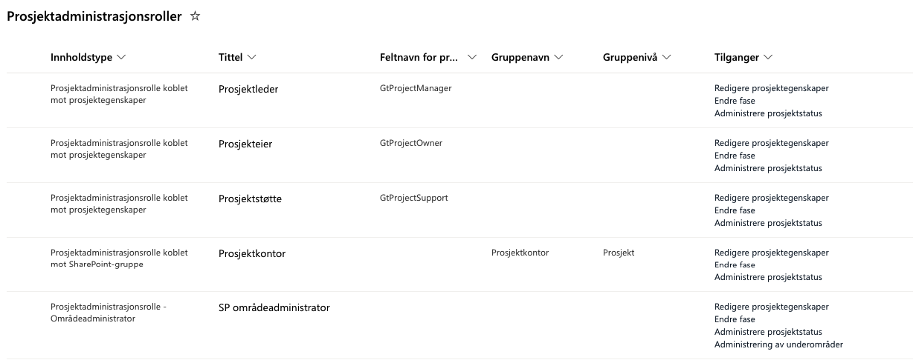

Det er også mulig å legge til flere roller med, eksempel: 'Gevinstansvarlig' eller grupper som er definert på porteføljenivå under 'Tillatelseskonfigurasjon' i Prosjektportalens administrasjonsområde

## Søkeboks i Prosjektoppsett dialog

Skrive noe om denne?

## Overordnede prosjekter i prosjektinformasjon

Det er nå mulig å vise prosjekter som er overordnet i Prosjektinformasjon webdelen. Dette kan slås av ved å redigere egenskapene til webelen.

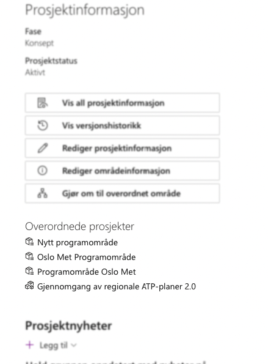

## Statusrapport i prosjektinformasjon

Det er lagt inn visning av statusrapporten på prosjektets forside. Som standard vises disse som ikoner (med statusfarge). Forhåndsvisning av tittel og kommentar får du ved å holde musepekeren over ikonet.

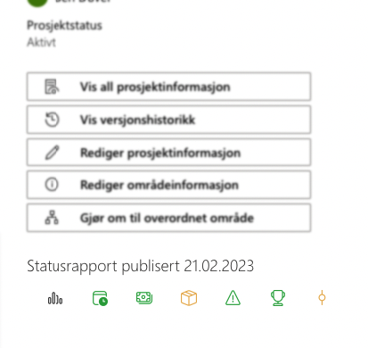

Ved å redigere webdelen er det mulig å skjule statusrapport. Det er også mulig å vise statusene med kommentarer dersom 'Vis kun ikoner' er avslått. Derifra kan du velge 'Avkort kommentarer' - da vil tekstfeltene vises med mindre eller mer tekst. Forhåndsvisning ved å holde musepekeren over vil fortsatt vise hele teksten.

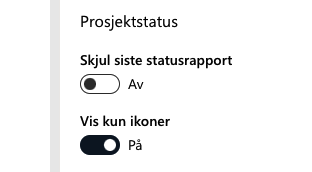

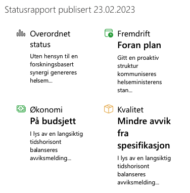

## Flere Planner planer

Man kan nå opprette prosjekter med mer enn en Planner plan. Dette kan gjøres på følgende måte:

1. Opprette to eller flere ulike mal-lister som danner utgangspunkt for to eller flere planner planer
2. Opprette element i Listeinnhold listen
3. Velg to eller flere planneroppgaver fra 'Oppsett av prosjektområde' dialog

Alle valgte planneroppgaver vil bli opprettet og vil bli synlige under 'Oppgaver' fra venstremeny.

## 'Tilgang til'-vertikal på forsiden

Tidligere var det kun mulig å se prosjekter på portalforsiden der du som bruker var lagt inn i Microsoft 365-gruppen for prosjektet. Med `Tilgang til` ser du også alle prosjekter du har blitt tildelt tilgang til via SharePoint-grupper.

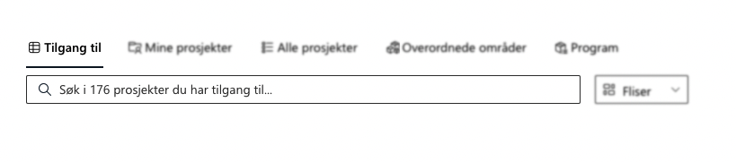

Visningen kan skjules som en global innstilling.

## FNs bærekraftsmål

Det er nå mulig å knytte prosjekter opp mot `FNs bærekraftsmål`. Dette gjøres ved å redigere prosjektinformasjonen.

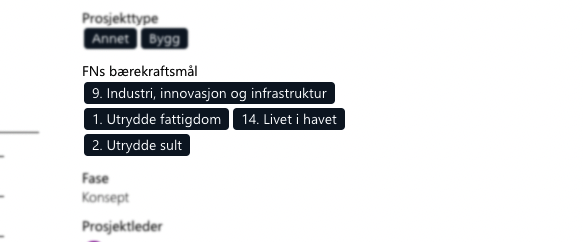

Dersom feltet ikke er synlig i prosjektet, kan du kjøre en synkronisering av prosjektinformasjon. Når synkroniseringen er ferdig vil feltet dukke opp ved redigering av prosjektinformasjon.

## Konfigurasjon av tekstfarge på prosjekttidslinje

Noen ganger opplevde brukere at tidslinje-elementer ble farget slik at teksten ble uleselig. Vi har derfor gjort det mulig å velge egne tekstfarger på elementer i tidslinjen.

For å endre tekstfarger eller konfigurere oppsettet til prosjekttidslinjen kan man gå til isten, `Tidslinjekonfigurasjon`, som er tilgjengelig i konfigurasjonssiden for Prosjektportalen under 'Porteføljekonfigurasjon'.

## Bygg- og anleggsmodulen

Bygg- og anleggsmodulen er nå tatt inn som en integrert del av Prosjektportalen 365. Det innebærer at denne blir automatisk installert når Prosjektportalen 365 installeres.

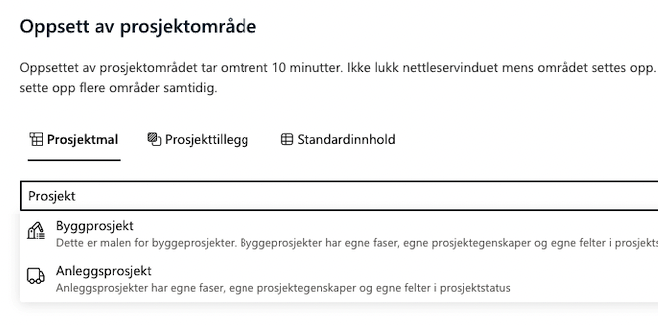

For kunder som skal oppgradere fra tidligere versjon, må følgende parameter legges til for å få med standardinnholdet i Bygg- og anleggsmodulen. `-IncludeBAContent`

## Unike fasesider (Prosjekttillegg)

Unike sider for hver fase som valgbart prosjekttillegg. Det er nå mulig å velge at hver fase skal ha sin egen side. Disse sidene er i utgangspunktet like som prosjektets hjemmeside, men kan da tilpasses av kunden slik at hver fase blir unik. Prosjekttillegget er skjult som standard og må slåes på dersom det skal dukke opp i 'Oppsett av prosjektområde dialog.

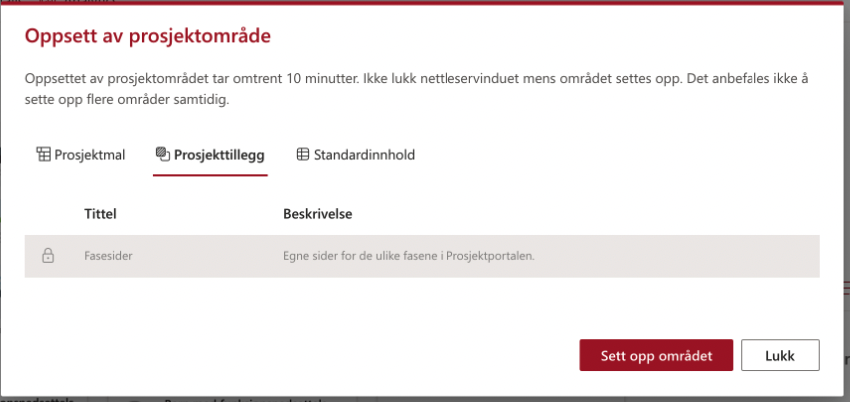

For å ta i bruk dynamisk endring av fasesider må dette spesifiseres i prosjektmalen på fasevelger webdelen.

## Logging av hendelser

Det er opprettet en ny liste hvor systemet lagrer hendelser som oppstår under oppsett og endringer i administrasjon av prosjekter. I praksis logges nå feil under prosjektopprettelse samt faseendringer og synkronisering av prosjektinformasjon.

Listen, `Logg`, er tilgjengelig i konfigurasjonssiden for Prosjektportalen under 'Avansert'.

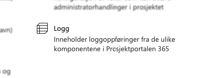

---
## Endringslogg

> For fullstendig endringslogg av alt som er med i denne utvigelsen, så kan du [trykke her for å lese mer](../CHANGELOG.md#180---28022023).

## Takk til dere

Sist men ikke minst sier vi takk til alle som har bidratt til å melde inn bugs og feil, gi oss verdifulle tilbakemeldinger og foreslå endringer.

Uten deres engasjement ville vi ikke vært i stand til å utvikle Prosjektportalen til det verktøyet det er i dag.

-Prosjektportalen-teamet
