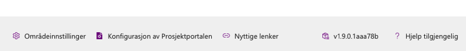
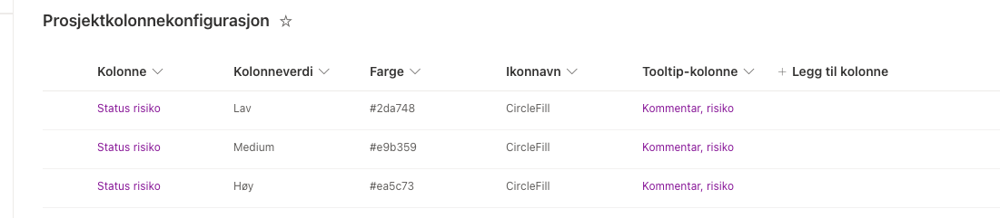
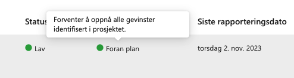
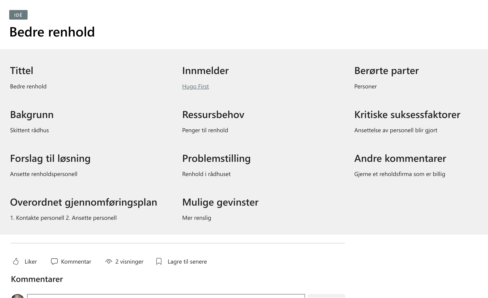
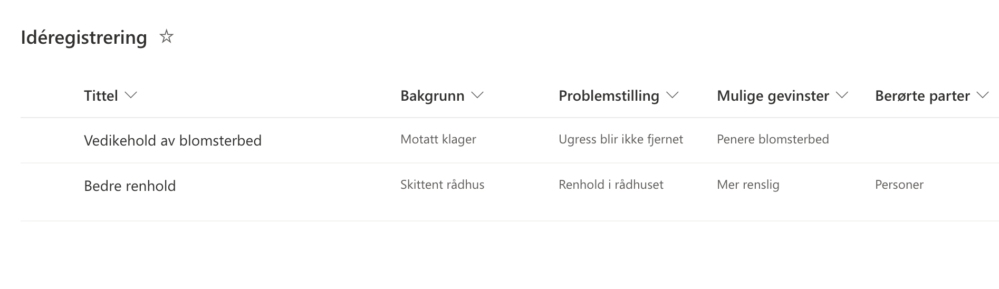
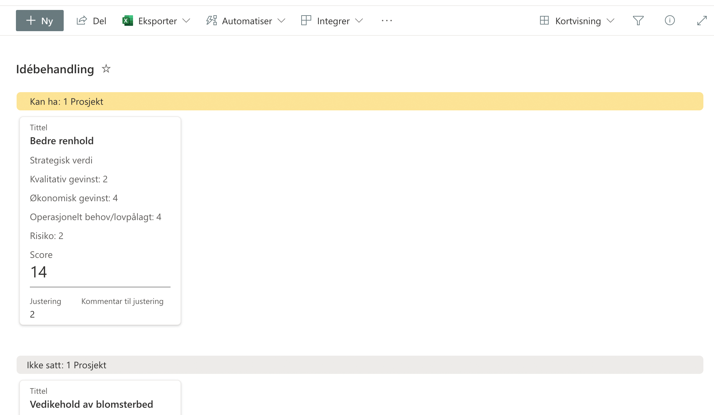
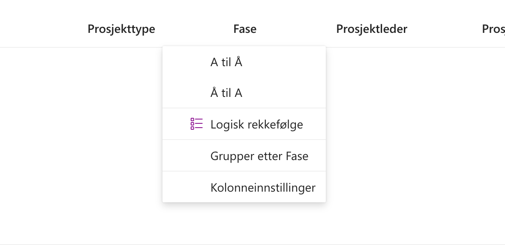

# Prosjektportalen 365 - 1.9.0 (Måned 2023)

**Versjon 1.9.0** adresserer følgende [issues](https://github.com/Puzzlepart/prosjektportalen365/issues?q=is%3Aissue+is%3Aclosed+milestone%3A1.9).
> **Nedlasting**: [v1.9.0](https://github.com/Puzzlepart/prosjektportalen365/releases)

---

Velkommen til versjon 1.9.0 av Prosjektportalen 365. I denne versjonen er det gjort flere endringer på det visuelle uttrykket til Prosjektportalen, flere av komponentene er blitt oppdatert. I tillegg er det flere grunnleggende endringer og forbedringer som gjør det verdt å oppgardere til. Her er noen av høydepunktene:

- **[Installere Prosjektportalen i ulike kanaler](#installere-prosjektportalen-i-ulike-kanaler)** - Frigjør produksjons- og testmiljø fra hverandre
- **[Footer](#footer)** - Rask tilgang til nyttig informasjon
- **[Rekkefølge på planneroppgaver](#rekkefølge-på-planneroppgaver)** - Overstyr rekkefølgen for planneroppgaver ved provisjonering
- **[Etiketter på planneroppgaver](#etiketter-på-planneroppgaver)** - Angi etiketter for planneroppgaver ved provisjonering
- **[Begrensninger på Planner](#begrensninger-på-planner)** - Rettet opp i problemer som ble forårsaket av begrensninger på Planner
- **[Tooltip-kolonne i porteføljeoversikten](#begrensninger-på-planner)** - Støtte for fremheving av innhold med tooltip-kolonne i porteføljeoversikten
- **[Idémodul, Prosjektscoring og konfigurasjon](#idémodul-prosjektscoring-og-konfigurasjon)** - Idémodul er nå en del av standard + prosjektscoring og konfigurasjon

---

## Footer

Det er lagt inn en statisk footer (bunn) i Prosjektportalen, denne vil være synlig på alle Portefølje-sider. Her har man rask tilgang til Områdeinnstillinger og Konfigurasjonsiden av Prosjektportalen. Det er også lagt inn `Nyttige lenker` som er en dialog som dukker opp når du holder over denne, lenkene som vises her kan tilpasses etter eget behov.

Her får du også fremvist hvilke versjon som er i bruk, holder du over denne får du informasjon om siste installasjon og lenke til siste versjon på GitHub.

## Installere Prosjektportalen i ulike kanaler

Det er nå mulig å installere to eller flere uavhengige Prosjektportalen instanser i samme tenant. For brukere som har produksjon og testmiljø installert vil det nå være mulig å oppgradere for eksempel testmiljø uten at man påvirker produksjon. Det vil være nødvendig å sette opp nytt test miljø for å anvende produksjon/test kanaler.

## Rekkefølge på planneroppgaver

Det er nå mulig å bestemme rekkefølgen for planneroppgaver ved provisjonering. Dette gjør det nå mulig å legge til nye elementer akkurat der du vil i 'Planneroppgaver' listen på porteføljenivå.

## Etiketter på planneroppgaver

Det er nå mulig å angi etiketter på planneroppgaver. Dette gjøres ved å legge inn etiketter, separert med semikolon i den nye kolonnen på Planneroppgaver listen(e). Under provisjonering vil den legge sammen alle etikettene som er angitt på listen, opprette disse i planneren og angi etikettene for hvert element i Planneroppgaver webdelen.

Dersom det ikke angis noen etiketter vil det heller ikke komme med etiketter. Vi følger begrensningen på 25 etiketter, dersom du angir flere enn 25 etiketter vil de overskytende ikke følge med under provisjonering

## Begrensninger på Planner

Et problem som omhandlet av brukere hadde angitt for mange sjekkpunkter, vedlegg, etiketter eller sjekkpunkt beskrivelser som var begrenset i Microsoft Planner er fikset. Disse begrensning er:

- Sjekkpunkter per oppgave: 20 punkter
- Beskrivelse/tittel på sjekkpunkt: 100 karakterer
- Vedlegg per oppgave: 10 vedlegg
- Etiketter på Planner: 25 etiketter

Dersom en av disse begrensningen var nådd tidligere ville ingen av elementene bli angitt, og en oppgave kunne mangle sjekkpunkter osv... Dette er nå fikset, dersom det angis for mange punkter, karakterer, vedlegg eller etiketter blir de overskytende fjernet. Dersom noe blir fjernet blir også dette logget i `Logg` listen.

## Tooltip-kolonne i porteføljeoversikten

Det er nå lagt inn søtte for å vise en `Tooltip` (melding) når man holder over bestemte kolonner i porteføljeoversikten. Med dette vil vi kunne blandt annet støtte å vise kommentarer for de ulike statusene eller annnen nyttig tekst.

Det er opprettet en ny kolonne inne i `Prosjektkolonnekonfigurasjon` listen som lar deg velge hvilke kolonne `Tooltip` skal vise innhold fra. Når brukerne "hovrer" over en kolonne som bruker `Prosjektkolonnekonfigurasjon`, vil `Tooltip`-kolonnens verdi vises.

Dette bidrar til å løfte oversikten enda et hakk ved å tilby en enkel, men effektiv måte å gi brukerne muligheten til å vise kommentarer og annet innhold for de ulike statusene og kolonnene.

## Idémodul, Prosjektscoring og konfigurasjon

Idémodulen er en samling av lister for å hente inn forslag og idéer til prosjekter, som kan utredes, diskuteres og anbefales. Organisasjoner kan bruke denne på ulike måter - og det er gjerne ikke noen "riktig måte". Benytt dere av listene og funksjonaliteten etter det som passer dere.

Idémodulen som tidligere var et Prosjektportalen 365 tillegg er nå en del av standardpakken. Her følger det med fire nye lister

- Idéregistrering, Idébehandling, Prosjektdata og Idékonfigurasjon

På listen Idébehandling følger det med en kortvisning av idéene, dette gir en god og oversiktlig visning for idéene som er registrert og behandles.

Det er i tillegg lagt opp en egen liste, Idékonfigurasjon, for å støtte flere forskjellige idéoppsett. Listen, `Idékonfigurasjon`, er tilgjengelig i konfigurasjonssiden for Prosjektportalen under 'Avansert'.

Du kan lese mer om Idémodulen [her](https://github.com/Puzzlepart/prosjektportalen365/wiki/Id%C3%A9modulen-i-Prosjektportalen).

## Egendefinert rekkefølge for kolonner

Det er nå mulig å angi en egendefinert rekkefølge for kolonner i porteføljeoversikten. En ny kolonne, `Egendefinerte sorteringsrekkefølger` , er nå tilgjengelig i Prosjektkolonner-listen.

Her er det mulig å sette opp egne rekkefølger med følgende format, under er et eksempel på den nye logiske rekkefølgen som følger med som standard for Fase kolonnen:

`Logisk rekkefølge(ikon-navn):Konsept,Planlegge,Gjennomføre,Avslutte,Realisere`

Formatet er altså `Navn på rekkefølge(frivillig ikon fra fluent UI):Element1,Element2,Element3`. Om du ønsker å spesifisere flere sorteringsrekkefølger bruk semikolon (;) for å skille dem.

---

## Endringslogg

> For fullstendig endringslogg av alt som er med i denne utvigelsen, så kan du [trykke her for å lese mer](../CHANGELOG.md#190---tba).

## Takk til dere

Sist men ikke minst sier vi takk til alle som har bidratt til å melde inn bugs og feil, gi oss verdifulle tilbakemeldinger og foreslå endringer.

Uten deres engasjement ville vi ikke vært i stand til å utvikle Prosjektportalen til det verktøyet det er i dag.

-Prosjektportalen-teamet
