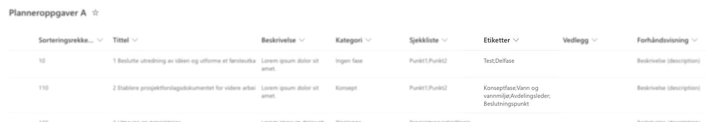
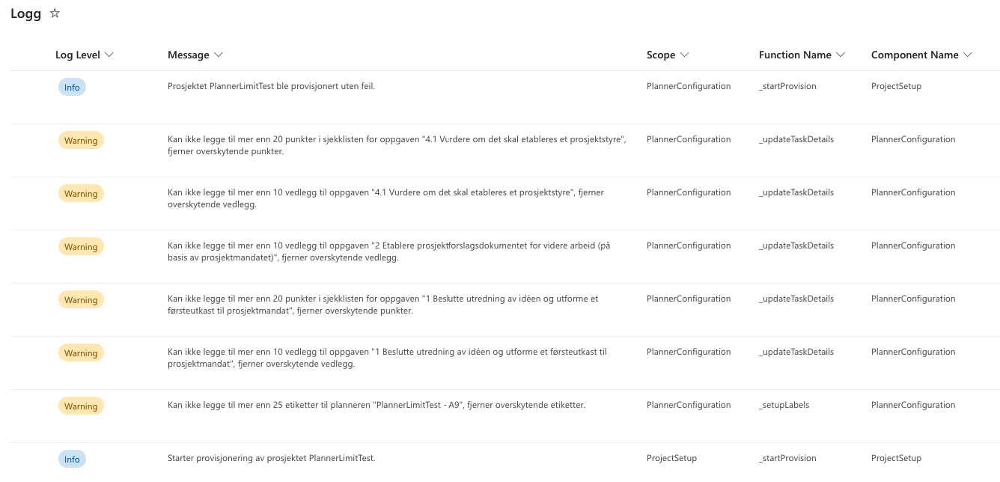

# Prosjektportalen 365 - 1.9.0 (Måned 2023)

**Versjon 1.9.0** adresserer følgende [issues](https://github.com/Puzzlepart/prosjektportalen365/issues?q=is%3Aissue+is%3Aclosed+milestone%3A1.9).
> **Nedlasting**: [v1.9.0](https://github.com/Puzzlepart/prosjektportalen365/releases)

---

Velkommen til versjon 1.9.0 av Prosjektportalen 365. I denne versjonen er det gjort flere endringer på det visuelle uttrykket til Prosjektportalen, flere av komponentene er blitt oppdatert. I tillegg er det flere grunnleggende endringer og forbedringer som gjør det verdt å oppgardere til. Her er noen av høydepunktene:

- **[Installere Prosjektportalen i ulike kanaler](#installere-prosjektportalen-i-ulike-kanaler)** - Frigjør produksjons- og testmiljø fra hverandre
- **[Rekkefølge på planneroppgaver](#rekkefølge-på-planneroppgaver)** - Overstyr rekkefølgen for planneroppgaver ved provisjonering
- **[Etiketter på planneroppgaver](#etiketter-på-planneroppgaver)** - Angi etiketter for planneroppgaver ved provisjonering
- **[Begrensninger på Planner](#begrensninger-på-planner)** - Rettet opp i problemer som ble forårsaket av begrensninger på Planner

---

## Rekkefølge på planneroppgaver

Det er nå mulig å bestemme rekkefølgen for planneroppgaver ved provisjonering. Dette gjør det nå mulig å legge til nye elementer akkurat der du vil i 'Planneroppgaver' listen på porteføljenivå.

## Installere Prosjektportalen i ulike kanaler

Det er nå mulig å installere to eller flere uavhengige Prosjektportalen instanser i samme tenant. For brukere som har produksjon og testmiljø installert vil det nå være mulig å oppgradere for eksempel testmiljø uten at man påvirker produksjon. Det vil være nødvendig å sette opp nytt test miljø for å anvende produksjon/test kanaler.

---

## Etiketter på planneroppgaver

Det er nå mulig å angi etiketter på planneroppgaver. Dette gjøres ved å legge inn etiketter, separert med semikolon i den nye kolonnen på Planneroppgaver listen(e). Under provisjonering vil den legge sammen alle etikettene som er angitt på listen, opprette disse i planneren og angi etikettene for hvert element i Planneroppgaver webdelen.

Dersom det ikke angis noen etiketter vil det heller ikke komme med etiketter. Vi følger begrensningen på 25 etiketter, dersom du angir flere enn 25 etiketter vil de overskytende ikke følge med under provisjonering

---

## Begrensninger på Planner

Et problem som omhandlet av brukere hadde angitt for mange sjekkpunkter, vedlegg, etiketter eller sjekkpunkt beskrivelser som var begrenset i Microsoft Planner er fikset. Disse begrensning er:

- Sjekkpunkter per oppgave: 20 punkter
- Beskrivelse/tittel på sjekkpunkt: 100 karakterer
- Vedlegg per oppgave: 10 vedlegg
- Etiketter på Planner: 25 etiketter

Dersom en av disse begrensningen var nådd tidligere ville ingen av elementene bli angitt, og en oppgave kunne mangle sjekkpunkter osv... Dette er nå fikset, dersom det angis for mange punkter, karakterer, vedlegg eller etiketter blir de overskytende fjernet. Dersom noe blir fjernet blir også dette logget i `Logg` listen.

## Endringslogg

> For fullstendig endringslogg av alt som er med i denne utvigelsen, så kan du [trykke her for å lese mer](../CHANGELOG.md#190---tba).

## Takk til dere

Sist men ikke minst sier vi takk til alle som har bidratt til å melde inn bugs og feil, gi oss verdifulle tilbakemeldinger og foreslå endringer.

Uten deres engasjement ville vi ikke vært i stand til å utvikle Prosjektportalen til det verktøyet det er i dag.

-Prosjektportalen-teamet
