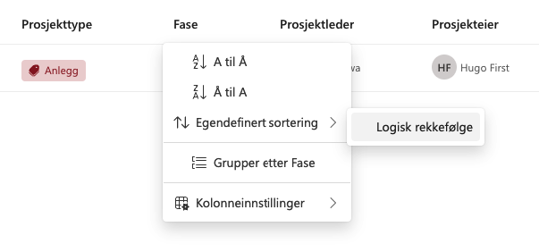

# Prosjektportalen 365 - 1.9.0 (Februar 2024)

**Versjon 1.9.0** adresserer følgende [issues](https://github.com/Puzzlepart/prosjektportalen365/issues?q=is%3Aissue+is%3Aclosed+milestone%3A1.9.0).
> **Nedlasting**: [v1.9.0](https://github.com/Puzzlepart/prosjektportalen365/releases)

---

Velkommen til versjon 1.9.0 av Prosjektportalen 365. I denne versjonen er det gjort flere endringer på det visuelle uttrykket til Prosjektportalen, flere av komponentene er blitt helrenovert og fått nytt utseende og tilpasningsmuligheter. Portalen vil oppleves raskere, da det er gjort store forbedringer og oppgradering av interne rammeverk. I tillegg er det flere grunnleggende endringer og forbedringer som gjør det verdt å oppgradere til. Her er noen av høydepunktene:

- **[Visuelt løft](#visuelt-løft)** - Prosjektportalen har fått et nytt visuelt løft med fokus på brukeropplevelse og moderne utførelse
  - **[Prosjektutlisting](#prosjektutlisting)** - Ny og interaktiv kortvisning med dynamiske farger og oppdatert listevisning
  - **[Porteføljeoversikt og aggregerte oversikter](#porteføljeoversikt-og-aggregerte-oversikter)** - Oppdaterte oversikter med bedre brukeropplevelse
  - **[Fasevelger](#fasevelger)** - Ny, responsiv og mer interaktiv fasevelger
  - **[Prosjektstatus](#prosjektstatus)** - Nytt og forbedret utseende for statusrapporter med seksjonsnavigator
  - **[Prosjektinformasjon](#prosjektinformasjon)** - Oppdatert utseende for prosjektinformasjon med forbedret redigering
- **[Installere Prosjektportalen i ulike kanaler](#installere-prosjektportalen-i-ulike-kanaler)** - Frigjør produksjons- og testmiljø fra hverandre
- **[Footer](#footer)** - Rask tilgang til nyttig informasjon
- **[Automatisk konfigurasjon av prosjekter](#automatisk-konfigurasjon-av-prosjekter)** - Automatisk konfigurasjon av prosjekter ved opprettelse
- **[Rekkefølge på planneroppgaver](#rekkefølge-på-planneroppgaver)** - Overstyr rekkefølgen for planneroppgaver ved provisjonering
- **[Etiketter på planneroppgaver](#etiketter-på-planneroppgaver)** - Angi etiketter for planneroppgaver ved provisjonering
- **[Tooltip-kolonne i porteføljeoversikten](#begrensninger-på-planner)** - Støtte for fremheving av innhold med tooltip-kolonne i porteføljeoversikten
- **[Håndtere tiltak for usikkerheter i Planner](#håndtere-tiltak-for-usikkerheter-i-planner)** - Nytt funksjonalitet for å angi tiltak for usikkerheter i Planner
- **[Idémodul, Prosjektscoring og konfigurasjon](#idémodul-prosjektscoring-og-konfigurasjon)** - Idémodul er nå en del av standard + prosjektscoring og konfigurasjon

## Visuelt løft

Vi har gjennomgått alle komponentene av Prosjektportalen, hver komponent har fått en omfattende oppgradering med et nytt visuelt uttrykk for en bedre brukeropplevelse. Noen av de mest betydningsfulle endringene inkluderer:

### Prosjektutlisting

Prosjektutlisting, forsiden til Prosjektportalen, har nå en ny og interaktiv kortvisning med dynamiske farger. Kortene viser mer data på mindre plass og er fullstendig tilpasningsvennlige, du kan velge å tilpasse disse etter deres behov. I tillegg har endelig listevisningen fått litt kjærlighet, med bedre sortering og metadata visning, samt en tilpasningsvennlig hurtigmeny for rask navigasjon til sider eller lister på prosjektet. I tillegg er kommandolinjen for bytting mellom vertikaler og søk blitt oppdatert, det er nå støtte for å søke etter personer og annen metadata tilknyttet prosjektene.

1. **Visning av prosjektfase på kortet:** Prosjektfasen vil nå være synlig som et merke oppe til høyre på kortene, slik at brukerne enkelt kan se hvilken fase hvert prosjekt befinner seg. Dette kan slås av/på.

2. **Etikettvisning for Tjenesteområde:** Det er nå lagt til en etikett som representerer prosjektets tjenesteområde. Dette gir brukerne en rask oversikt over hva prosjektet handler om. Dersom det er mange tjenesteområder grupperes disse og kan vises ved å trykke på `+` knappen. Dette kan slås av/på.

3. **Etikettvisning for Prosjekttype:** En ny etikett som viser prosjekttypen er introdusert. Dette bidrar til å lettere se klassifiseringen av prosjekter etter deres type. Dette kan slås av/på.
  
4. **Hurtigmeny:** Det er lagt inn en liten knapp for å få fram hurtigmenyen til prosjektet, denne ligger mellom prosjektmal og 'åpne prosjektinformasjonspanel'-knappen. Denne kan tilpasses ved å redigere webdelen og trykke på `Rediger hurtigmeny valg`.

   

5. **Prosjektmal:** Det er lagt inn en liten indikator for hva slags mal prosjektet er opprettet fra, denne ligger til venstre for personene.

6. **Genererte bilder erstattet med ren kode:** Tidligere brukte prosjektene automatisk genererte bilder med to bokstaver. Grunnet tidligere 'ikke web-vennlige' farger og dårlig kvalitet på genererte bilder så er dette erstattet med ren kode og mykere farger. Dette gjelder ikke dersom det er angitt egendefinerte bilder på prosjektene.

7. **Introduksjon av dynamiske farger og gradienter:** Det lages nå en fargepalett ut ifra egendefinert bilde, disse fargene brukes så på prosjektets tittel og bunn, hvor gradienten brukes bak prosjekttittelen på kortene. Dette skaper en dynamisk og visuelt tiltalende effekt, som bidrar til å fremheve hvert prosjekts unike identitet. Dette kan slås av/på.

8. **Minimalistisk visning:** Dersom Vis logo, prosjekteier, prosjektleder, tjenesteområder, prosjekttype og prosjektfase er slått av kan man oppnå et minimalistisk uttrykk.

   

### Porteføljeoversikt og aggregerte oversikter

Porteføljeoversikt og aggregerte oversikt webdeler har fått oppdatert utseende med mer interaktivitet. Dette inkluderer kontekstspesifikke paneler for enklere opprettelse og redigering av visninger/kolonner. Videre er det introdusert et nytt panel for visning og rekkefølgeendringer, som gir brukerne mulighet til å tilpasse visningen av kolonner etter behov.

1. **Nytt panel for opprettelse og redigering**: Det er nå lagt til nye paneler som er mer tilpasset konteksten man står i, disse inneholder de samme feltene som tidligere, men mer tilpasset det man prøver å opprette eller redigere. Disse panelene finner dere også i `Prosjektstatus`, `Prosjektinformasjon` og `Prosjekttidslinje (Prosjektnivå)` webdelene.

2. **Panel for vis/skjul, endre rekkefølge**: Det finnes nå et nytt panel for å vise/skjule kolonner og endre rekkefølge. Dette gjør det enklere å tilpasse visningens kolonner etter deres behov og preferanser. Kolonner kan endres ved bruk av `drag and drop` for å endre rekkefølge. Knappen for dette finnes øverst helt til høyre ved siden av siste kolonnen i visningen, `+ Legg til kolonne` og deretter velge `Vis eller skjul kolonner`.

   

3. **Excel eksport**: Knappen for å eksportere til Excel er nå flyttet til venstre for visningsvelgeren. Funksjonaliteten for knappen har fått noen forbedringer, den vil nå kun eksportere det som er synlig basert på filtrering som er gjort, samt det som er valgt. Dersom det ikke er gjort noen filtrering eller valg vil den eksportere alt.

4. **Programområde visninger**: Det er nå mulig å hente fram visninger til programmer og deres underområder. Fra visningsvelgeren kan du nå velge visningen fra et programområde, visningen vil så vise alle underområder tilknyttet programmet. Dette gjør det enklere å få en oversikt over alle underområdet i et programområde rett fra porteføljen.

   

### Fasevelger

Den nye, responsive og mer interaktive fasevelgeren gir en forbedret måte å utforske og navigere gjennom ulike faser i prosjektene. Det er også en ny og mer oversiktlig visning av fasesjekkpunkter og oppsummering ved endring av fase. Det er også gjort en betraktelig forbedring rundt synkroniseringstid av faseendringer.

1. **Ny, responsiv og mer interaktiv fasevelger**: Den nye fasevelgeren er mer responsiv og interaktiv, og er med i tråd med prosjektveiviserens modell. Den er også mer tilpasset det nye visuelle uttrykket til Prosjektportalen. På bildet under kan du se en ny indikatorlinje for antall sjekkpunkter som må gjennomgås. Det er også lagt inn informasjon om hvilken fase man endrer til/fra.

   

2. **Ny og mer oversiktlig visning av fasesjekkpunkter**: Det er nå lagt til en ny visning av fasesjekkpunkter og oppsummering ved endring av fase. Dette gir brukerne en mer oversikt over hvilke fase de gjennomgår, hvor mange, og hvilke som er neste.

   

3. **Endre utforming av fasepunkt**: Det er nå mulig å angi indikasjon på start og avslutning på pilenes utforming. Som standard vises pilene på øverste bildet. Dette kan slås på og av etter eget ønske.

   

4. **Fase underskrift og beskrivelse**: Det er nå mulig å angi en beskrivelse og underskrift for hver fase. Dette kan slås på og av etter eget ønske. Dette gjøres i fase termsettet i termlageret. Underskriften (`PhaseSubText`) vises direkte på fasepunktene, mens beskrivelsen (`PhaseDescription`) for fasen vises i kortet som dukker opp når man trykker på en fase.

   

5. **Betraktelig forbedring rundt synkroniseringstid av faseendring**: Det er gjort en betydelig forbedring rundt synkroniseringstid av faseendringer. Dette gjør at brukerne nå vil oppleve en mer responsiv og raskere faseendring.

### Prosjektstatus

Prosjektstatusrapportene har fått et nytt og forbedret utseende med en inkludert seksjonsnavigator øverst. Seksjoner og matriser er fornyet for bedre lesbarhet og brukervennlighet. Det er også introdusert et nytt og forbedret panel for redigering og opprettelse av prosjektstatusrapporter.

1. **Seksjonsnavigator**: Det er nå lagt til en seksjonsnavigator øverst på prosjektstatus sidene. Dette gjør det enklere å navigere mellom seksjonene i rapporten.

   

2. **Nye og forbedrede seksjoner**: Seksjonene har fått nytt og mer moderne utseende for bedre lesbarhet og brukervennlighet.

   

3. **Nye konfigurasjonsmuligheter og farger for matriser**: Matrisene for risiko og muligheter har fått nye fargepaletter og konfigurasjonsmuligheter for å endre oppsett, etiketter og farger lettere på et globalt nivå. Ut av boksen tilbyr vi oppsett for 5x5 med en fargepalett som er mer til tro mot standard risikomatriser.

   

### Prosjektinformasjon

Prosjektinformasjon har fått oppdatert utseende med mer interaktivitet. Et nytt panel gjør det enklere å redigere prosjektinformasjon, og det er gjort betydelig forbedring rundt synkronisering av endringer.

1. **Oppdatert utseende med mer interaktivitet**: Det er gjort en rekke forbedringer på brukeropplevelsen og interaktiviteten i prosjektinformasjon. Webdelen tar nå mindre plass og tilgjengeliggjør mer informasjon enn tidligere, felter som `Tjenesteområde`, `Prosjekttype` og `FNs bærekraftsmål` er gjort om til etiketter. Dersom det er eksempelvis mange tjenesteområder grupperes disse og kan vises ved å trykke på `+` knappen ved siden.

   

   

2. **Nytt panel for redigering av prosjektinformasjon**: Det er lagt til et nytt og forbedret panel for redigering av prosjektinformasjon. Dette gjør det enklere å oppdatere og redigere prosjektinformasjonen.

3. **Betraktelig forbedring rundt synkroniseringstid av prosjektinformasjon**: Det er gjort en betydelig forbedring rundt synkroniseringstid av prosjektinformasjon. Dette gjør at brukerne nå vil oppleve en mer responsiv og raskere synkronisering av endringer i prosjektinformasjonen enn noen gang før. På bildet under ser dere indikasjon for synkronisering, dette vil vises når man trykker på knappen `Lagre` i bunnen. Dette skjer så fort at man nesten ikke rekker å se det.

   

## Footer

Det er lagt inn en statisk footer (bunn) i Prosjektportalen, denne vil være synlig på alle sider i både portefølje og prosjektområder. Som eier og administrator har man rask tilgang til `Områdeinnstillinger` og `Konfigurasjon av Prosjektportalen` siden. Det er også lagt inn `Nyttige lenker` som er en dialog som dukker opp når du holder over denne, lenkene som vises her kan tilpasses etter eget behov.

Her får du også fremvist hvilke versjon som er i bruk, holder du over denne får du informasjon om siste installasjon og lenke til siste versjon på GitHub.

## Installere Prosjektportalen i ulike kanaler

Det er nå mulig å installere to eller flere uavhengige Prosjektportalen-instanser i samme tenant. Fra og med versjon 1.9 vil brukere som installerer produksjonsmiljø og testmiljø, kunne oppgradere for eksempel testmiljø uten at man påvirker produksjonsmiljøet. Det vil være nødvendig å sette opp nytt testmiljø for å anvende produksjon/test installasjonskanaler. Det kan for eksempel være lurt å skille produksjon og testmiljø for å kunne teste ut nye funksjoner før de rulles ut i produksjon, eventuelt egne miljøer for kurs og opplæring.

## Automatisk konfigurasjon av prosjekter

Den nye funksjonen for automatisk konfigurasjon av prosjekter ved opprettelse gir en betydelig tidsbesparelse slik at brukere slipper å manuelt angi hva prosjektet skal inneholde som vil gi en mer effektiv oppstartsprosess. Dette kan konfigureres på maler som er satt som standard i `Maloppsett` listen. Se etter `Konfigurer automatisk` kolonnen når du redigerer en mal.

## Konfigurerbar malbibliotek-sti

Muligheten til å angi en egen sti til malbiblioteket gir brukerne egne biblioteker basert på for eksempel forskjellige typer prosjekter, slik at man får en skreddersydd tilnærming til organiseringen av maler. Dette gir økt kontroll og fleksibilitet i håndteringen av mal-administrasjon. Dette kan konfigureres på malene i `Maloppsett` listen. Se etter `Malbibliotek` kolonnen når du redigerer en mal.

## Mer plass på prosjektforsidene

I nye områder som blir opprettet etter oppgradering eller installasjon av 1.9, vil dere oppleve at forsiden til prosjektområdene har fått mer plass. Dette er gjort for å gi mer plass til innholdet som er viktig og gi en mer luftig og oversiktlig opplevelse. Inndelingen bruker nå Loddrett inndeling. For eksempel vil Fasevelger og Oppgaver webdelene utbytte mer plass på siden, mens Prosjektinformasjon og Prosjektnyheter legger seg helt til høyre. Dette kan også gjøres på eksisterende prosjektområder ved å redigere siden og velge `Loddrett inndeling` under `Inndeling`, deretter flytte webdelene der det ønskes.

## Rekkefølge på planneroppgaver

Det er nå mulig å bestemme rekkefølgen for planneroppgaver ved provisjonering. Dette gjør det nå mulig å legge til nye elementer akkurat der man ønsker basert på rekkefølge verdien i 'Planneroppgaver' listen på porteføljenivå. Samlingene (Kategori) vil også komme inn i rekkefølgen som er bestemt.

## Etiketter på planneroppgaver

Det er nå mulig å angi etiketter på planneroppgaver. Dette gjøres ved å legge inn etiketter, separert med semikolon i den nye kolonnen på Planneroppgaver listen(e). Under provisjonering vil den legge sammen alle etikettene som er angitt på listen, opprette disse i planneren og deretter angi etikettene for hvert element i Planner webdelen. Merk! denne kan påvirke tiden det tar å provisjonere prosjekter betraktelig dersom det er mange oppgaver og etiketter.

Dersom det ikke angis noen etiketter, vil det heller ikke komme med etiketter. Vi følger begrensningen på 25 etiketter og dersom du angir flere enn 25 etiketter vil de overskytende ikke følge med under provisjonering, begrensninger som dette vil bli logget i `Logg` listen.

## Begrensninger på Planner

Et problem som omhandlet av brukere hadde angitt for mange sjekkpunkter, vedlegg, etiketter eller sjekkpunkt beskrivelser som var begrenset i Microsoft Planner er fikset. Disse begrensning er:

- Sjekkpunkter per oppgave: 20 punkter
- Beskrivelse/tittel på sjekkpunkt: 100 karakterer
- Vedlegg per oppgave: 10 vedlegg
- Etiketter på Planner: 25 etiketter

Dersom en av disse begrensningen var nådd tidligere ville ingen av elementene bli angitt, og en oppgave kunne mangle sjekkpunkter osv... Dette er nå fikset, dersom det angis for mange punkter, karakterer, vedlegg eller etiketter blir de overskytende fjernet. Dersom noe blir fjernet blir også dette logget i `Logg` listen.

## Tooltip-kolonne i porteføljeoversikten

Det er nå lagt inn støtte for å vise en `Tooltip` (melding) når man holder over bestemte kolonner i porteføljeoversikten. Med dette vil vi kunne blant annet støtte å vise kommentarer for de ulike statusene eller annnen nyttig informasjon.

Det er opprettet en ny kolonne inne i `Prosjektkolonnekonfigurasjon` listen som lar deg velge hvilke kolonner `Tooltip` skal vise innhold på. Når brukerne holder over en kolonne som bruker `Tooltip-kolonne`, vil verdien som er angitt vises.

Dette bidrar til å løfte oversikten enda et hakk ved å tilby en enkel, men effektiv måte å gi brukerne muligheten til å vise kommentarer og annet innhold for de ulike statusene og kolonnene.

## Idémodul, Prosjektscoring og konfigurasjon

Idémodulen er en samling av lister for å hente inn forslag og idéer til prosjekter, som kan utredes, diskuteres og anbefales. Organisasjoner kan bruke denne på ulike måter - og det er gjerne ikke noen "riktig måte". Benytt dere av listene og funksjonaliteten etter det som passer dere.

Idémodulen som tidligere var et Prosjektportalen 365 tillegg er nå en del av standardpakken. Her følger det med fire nye lister. Listene er tilgjengelig i `Konfigurasjon av Prosjektportalen` under seksjonen `Idémodul`, disse kan man etter eget ønske legge til i Nyttige lenker i footeren for å tilgjengeliggjøre listene til sluttbrukere eller i navigasjonsmenyen i toppen.

Listene som følger med, er:

- Idéregistrering, Idébehandling, Prosjektdata og Idékonfigurasjon

På listen Idébehandling følger det med en kortvisning av idéene, dette gir en god og oversiktlig visning for idéene som er registrert og behandles.

Det er i tillegg lagt opp en egen liste, Idékonfigurasjon, for å støtte flere forskjellige idéoppsett, eller overstyre beskrivelser i dialoger tilpasset eget behov. Listen, `Idékonfigurasjon`, er tilgjengelig i konfigurasjonssiden for Prosjektportalen under 'Avansert'.

**Hvordan kan en idé opprettes som et prosjekt?**

For å få til dette må løsningen integreres med en provisjoneringsløsning. Dette gjøres gjerne via en Power Automate Flow som tar en ferdigbehandlet idé og automatisk bestiller et prosjektområde og deretter sender med metadata fra Prosjektdata tilknyttet idéen. Dette er ikke noe som er med i standardløsningen per i dag, men ta kontakt dersom det kan være aktuelt for dere.

Du kan lese mer om Idémodulen [her](https://github.com/Puzzlepart/prosjektportalen365/wiki/Id%C3%A9modulen-i-Prosjektportalen).

## Egendefinert rekkefølge for kolonner

Det er nå mulig å angi en egendefinert rekkefølge for kolonner i porteføljeoversikten. En ny kolonne, `Egendefinerte sorteringsrekkefølger`, er nå tilgjengelig i Prosjektkolonner-listen.

Her er det mulig å sette opp egne rekkefølger med følgende format, under er et eksempel på den nye logiske rekkefølgen som følger med som standard for Fase kolonnen:

`Logisk rekkefølge(ikon-navn):Konsept,Planlegge,Gjennomføre,Avslutte,Realisere`

Formatet er altså `Navn på rekkefølge(frivillig ikon fra fluent UI):Element1,Element2,Element3`. Om du ønsker å spesifisere flere sorteringsrekkefølger bruk semikolon `;` for å skille dem.

## Håndtere tiltak for usikkerheter i Planner

Den nye funksjonaliteten for håndtering av tiltak knyttet til usikkerheter i Planner gir prosjektledere et ekstra verktøy for å håndtere risiko effektivt. Dette bidrar til bedre planlegging og gjennomføring av prosjekter, samtidig som det styrker evnen til å håndtere uforutsette utfordringer.

Inne på Usikkerhetslisten på for eksempel et prosjekt vil man må kunne holde over en tiltaksverdi under Tiltak kolonnen for å få opp ny dialog. Her kan man velge å legge til nytt tiltak eller migrere tiltakene direkte til Planner.

---

## Etiketter på planneroppgaver

Det er nå mulig å angi etiketter på planneroppgaver. Dette gjøres ved å legge inn etiketter, separert med semikolon i den nye kolonnen på Planneroppgaver listen(e). Under provisjonering vil den legge sammen alle etikettene som er angitt på listen, opprette disse i planneren og angi etikettene for hvert element i Planneroppgaver webdelen.

Dersom det ikke angis noen etiketter vil det heller ikke komme med etiketter. Vi følger begrensningen på 25 etiketter, dersom du angir flere enn 25 etiketter vil de overskytende ikke følge med under provisjonering

---

## Begrensninger på Planner

Et problem som omhandlet av brukere hadde angitt for mange sjekkpunkter, vedlegg, etiketter eller sjekkpunkt beskrivelser som var begrenset i Microsoft Planner er fikset. Disse begrensning er:

- Sjekkpunkter per oppgave: 20 punkter
- Beskrivelse/tittel på sjekkpunkt: 100 karakterer
- Vedlegg per oppgave: 10 vedlegg
- Etiketter på Planner: 25 etiketter

Dersom en av disse begrensningen var nådd tidligere ville ingen av elementene bli angitt, og en oppgave kunne mangle sjekkpunkter osv... Dette er nå fikset, dersom det angis for mange punkter, karakterer, vedlegg eller etiketter blir de overskytende fjernet. Dersom noe blir fjernet blir også dette logget i `Logg` listen.

## Endringslogg

> For fullstendig endringslogg av alt som er med i denne utgivelsen, så kan du [trykke her for å lese mer](../CHANGELOG.md#190---08022024).

## Takk til dere

Sist, men ikke minst sier vi takk til alle som har bidratt til å melde inn bugs og feil, gi oss verdifulle tilbakemeldinger og foreslå endringer.

Uten deres engasjement ville vi ikke vært i stand til å utvikle Prosjektportalen til det verktøyet det er i dag.

-Prosjektportalen-teamet
