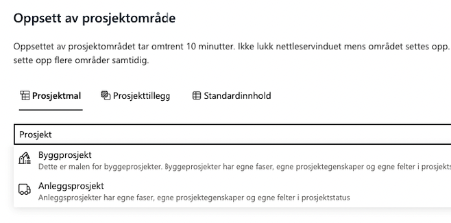

# Prosjektportalen 365 - 1.8.0 (Februar 2023)

**Versjon 1.8.0** adresserer følgende [issues](https://github.com/Puzzlepart/prosjektportalen365/issues?q=is%3Aissue+is%3Aclosed+milestone%3A1.8).

**Nedlasting**: [v1.8.0](https://github.com/Puzzlepart/prosjektportalen365/releases)

---

Velkommen til versjon 1.8.0 av Prosjektportalen 365. Det er flere grunnleggende endringer i løsningen som gjør det verdt å oppgardere til siste versjon. Her er noen av høydepunktene:

- **[Rettighetsstyring av komponenter](#rettighetsstyring-av-komponenter)** - Styre hvilke roller som har tilgang til hva
- **[Søkeboks i prosjektoppsett dialog](#søkeboks-i-prosjektoppsett-dialog)** - Det er nå støtte for søk i prosjektoppsett dialog
- **[Overordnede prosjekter i prosjektinformasjon](#overordnede-prosjekter-i-prosjektinformasjon)** - Visning av overordnede prosjekter som prosjektet er tilknyttet til
- **[Statusrapport i prosjektinformasjon](#statusrapport-i-prosjektinformasjon)** - Kjente ikoner fra statusrapport vises nå på prosjektforsiden
- **[Flere planner planer](#flere-planner-planer)** - Opprett prosjekter med flere planner planer per prosjekt
- **['Tilgang til'-vertikal på forsiden](#tilgang-til-vertikal-på-forsiden)** - Mulighet for å se alle prosjekter du har tilgang til
- **[Bygg- og anleggsmodulen](#bygg--og-anleggsmodulen)** - Modulen er nå en del av standardpakken
- **[Logging av hendelser](#bygg--og-anleggsmodulen)** - Ny liste for logging av hendelser og feil

## Rettighetsstyring av komponenter

Lorem ipsum dolor sit amet.

## Søkeboks i Prosjektoppsett dialog

Lorem ipsum dolor sit amet.

## Overordnede prosjekter i prosjektinformasjon

Lorem ipsum dolor sit amet.

## Statusrapport i prosjektinformasjon

Kjente ikoner fra statusrapport vises nå på prosjektforsiden

## Flere planner planer

Man kan nå ha mer enn 1 Planner for hvert prosjekt. Dette kan gjøres på to måter: 

1. Opprette 2 ulike mallister som danner utgangspunkt for 2 plannere dersom man ønsker de opprettet med standard innhold.  

   - Viktig å huske på å legge til flere sider også 

2. Opprette manuelt i etterkant av at prosjektet er opprettet 

   - I de tilfeller hvor man for eksempel vil skille standard prosjektoppgaver som kommer fra Prosjektveiviseren fra "løse/ frie" oppgaver som tilhører prosjektet 

## FNs bærekraftsmål

Det er nå mulig å knytte nye prosjekter opp mot `FNs bærekraftsmål`. Dette gjøres ved å redigere prosjektinformasjonen.

## 'Tilgang til'-vertikal på forsiden

Tidligere var det kun mulig å se prosjekter på portalforsiden der du som bruker var lagt inn i Microsoft 365-gruppen for prosjektet. Med `Tilgang til` ser du også alle prosjekter du har blitt tildelt tilgang til via SharePoint-grupper.

Visningen kan skjules som en global innstilling.

## Etiketter på prosjektleveranser

Det er mulig å vise etiketter for Prosjektleveranser på prosjektets tidslinje

## Konfigurasjon av tekstfarge på prosjekttidslinje

Støtte for selvvalgte tekstfarger i prosjekttidslinje

## Bygg- og anleggsmodulen

Bygg- og anleggsmodulen er nå tatt inn som en integrert del av Prosjektportalen 365. Det innebærer at denne blir automatisk installert når Prosjektportalen 365 installeres.

For kunder som skal oppgradere fra tidligere versjon, må følgende parameter legges til for å få med standardinnholdet i Bygg- og anleggsmodulen. `-IncludeBAContent`

## Unike fasesider (Prosjekttillegg)

Unike sider for hver fase som valgbart prosjekttillegg. Det er nå mulig å velge at hver fase skal ha sin egen side. Disse sidene er i utgangspunktet like som prosjektets hjemmeside, men kan da tilpasses av kunden slik at hver fase blir unik.

## Logging av hendelser

Ny liste for logging av hendelser. Det er opprettet en ny liste hvor systemet lagrer hendelser som oppstår under oppsett og endringer i administrasjon av prosjekter. I praksis logges nå feil under prosjektopprettelse samt faseendringer.

Listen er tilgjengelig i konfigurasjonssiden for Prosjektportalen.
